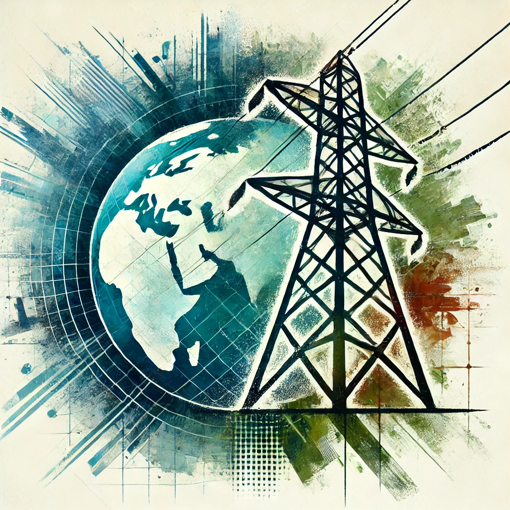

# Awesome Electric Grid Mapping

<table>
<tr>
<td>
<b>A curated list of resources in the field of electric grid mapping to improve global open data coverage, harmonization and quality for a sustainable energy transition.</b>
</td>
<td>

</td>
</tr>
</table>

## Grid Explorer and National Datasets
### Global 
* [Open Infrastructure Map](https://openinframap.org/)
* [GridFinder](https://gridfinder.rdrn.me/)
* [FLOSM Power Grid](https://www.flosm.org/en/powergrid.html)
* [Electricity Maps - Electricity Grid Carbon Emissions](https://app.electricitymaps.com/) [[Code](https://github.com/electricitymaps/electricitymaps-contrib)]

### Africa
* [Africa Electricity Grids Explorer](https://africagrid.energydata.info/)

### Asia
* [Baker Institute China Energy Map](https://www.bakerinstitute.org/chinas-energy-infrastructure)
* [OSW Project Areas & Transmission Lines - Japan](https://www.renewable-ei.org/statistics/offshoremap/?page=en)
* [India Power Grid Map](https://powermin.gov.in/en/content/powergrid-map)
* [ASEAN Energy Database - South-East Asia](https://www.arcgis.com/apps/View/index.html?appid=a840b350e8744ef6a523abd361f10738)

### Australia
* [Electricity Transmission Lines - Digital Atlas Australia](https://digital.atlas.gov.au/datasets/digitalatlas::electricity-transmission-lines/explore)

### Europe 
* [ENTSO-E Transmission System Map](https://www.entsoe.eu/data/map/)
* [JAO Static Grid Model](https://www.jao.eu/sites/default/files/static-grid/)
* [National Grid UK](https://www.nationalgrid.com/electricity-transmission/network-and-infrastructure/network-route-maps)
* [Uebertragungsnetz.de - Germany Grid Live Data](https://www.uebertragungsnetz.de/)

### North America
* [EIA U.S. Energy Atlas](https://atlas.eia.gov/datasets/geoplatform::transmission-lines/)
* [U.S. Electric Power Transmission Lines](https://www.arcgis.com/apps/mapviewer/index.html?layers=d4090758322c4d32a4cd002ffaa0aa12)
* [California Energy Commision - Electric Transmission Lines](https://cecgis-caenergy.opendata.arcgis.com/datasets/260b4513acdb4a3a8e4d64e69fc84fee_2/explore)
* [ERCOT Transmission Grid Map - Texas](https://www.ercot.com/gridinfo/transmission) (Can only be visited from the US)
* [California Electric Substations](https://databasin.org/datasets/cb9ff78949db409f83d4d6ca38f707bf/)
* [US Electric Substations](https://catalog.data.gov/dataset/electric-substations)
* [Electricity Transmission in Canada + US](https://www.arcgis.com/apps/mapviewer/index.html?webmap=fec6a654d2d44a0688b8c6d8c9c95367)
* [U.S. Atlas of Electric Distribution System Hosting Capacity Maps](https://www.energy.gov/eere/us-atlas-electric-distribution-system-hosting-capacity-maps)
* [AESO Transmission Capability Map 2024 - Canada](https://www.aeso.ca/grid/connecting-to-the-grid/transmission-capability-map)
* [Yukon Energy Corporation Power Substations - Canada](https://open.canada.ca/data/en/dataset/40397f7a-4f89-44a5-de41-923342bb6fea/resource/3c45137c-32c2-43cc-8d84-bb9c08f8e7c8)

### South and Middle America
* [Webmap EPE - Brazil Transmission Grid](https://gisepeprd2.epe.gov.br/WebMapEPE/)
* [Latin America Energy Outlook Interactive Map](https://www.iea.org/data-and-statistics/data-tools/latin-america-energy-outlook-interactive-map)
* [Mapa del Sistema Eléctrico Nacional - Mexico](https://energia.conacyt.mx/planeas/electricidad/sistema-electrico-nacional)

## OpenStreetMap

### Forums and Community
* [Power Networks](https://wiki.openstreetmap.org/wiki/Power_networks)
* [Power Forum Posts](https://community.openstreetmap.org/tag/power)
* [Infrastructure Matrix Channel](https://app.element.io/#/room/#osm-infrastructure:matrix.org)

### Power Tags
* [Key:power](https://wiki.openstreetmap.org/wiki/Key:power)
* [Power:proposals](https://wiki.openstreetmap.org/wiki/Key:power#Proposals)
* [Power Tag Statistics](https://taginfo.openstreetmap.org/keys/power)
* [OSM History Analyser](https://dashboard.ohsome.org/) [Code](https://github.com/giscience/ohsome-dashboard)
* [OSMstats](https://osmstats.neis-one.org/)

### Quality Assurance Tools
* [osmose](https://osmose.openstreetmap.fr/en/map/#loc=7/45.06/-122.762&level=1%2C2%2C3&tags=power&item=7040%2C7190%2C8270%2C8280%2C8281%2C8282%2C8290%2C9100)
* [Loop detection](https://waterwaymap.org/loops/#map=2/0/0)

### Editor
* [id](https://github.com/openstreetmap/iD)
* [RapiD](https://github.com/facebook/Rapid)
* [JOSM](https://github.com/JOSM)
* [MapWithAI](https://github.com/JOSM/MapWithAI)

## Data Catalogs 
* [ENERGYDATA.INFO](https://energydata.info/) - Open Data and Analytics for a sustainable energy future
* [Transmission network datasets wiki of openmod](https://wiki.openmod-initiative.org/wiki/Transmission_network_datasets) 
* [Global Transmission Database](https://zenodo.org/records/10870602) - Consists of comprehensive data regarding existing and planned cross-border transmission capacities globally collated from public sources.
* [Open Energy Platform Grid Data](https://openenergyplatform.org/dataedit/view/grid)
* [Electricitymaps Data Sources](https://github.com/electricitymaps/electricitymaps-contrib/blob/master/DATA_SOURCES.md)

## Scientfic Publications
* [Predictive mapping of the global power system using open data](https://www.nature.com/articles/s41597-019-0347-4)
* [Modelling the High-Voltage Grid Using Open Data for Europe and Beyond](https://arxiv.org/abs/2408.17178)
* [GridTracer: Automatic Mapping of Power Grids using Deep Learning and Overhead Imagery](https://arxiv.org/abs/2101.06390)
* [Towards an open pipeline for the detection of critical infrastructure from satellite imagery—a case study on electrical substations in The Netherlands](https://iopscience.iop.org/article/10.1088/2634-4505/ad63c9/pdf)
* [PGRID: Power Grid Reconstruction in Informal Developments Using High-Resolution Aerial Imager](https://arxiv.org/html/2412.07944v1)
* [Remote sensing methods for power line corridor surveys](https://www.sciencedirect.com/science/article/pii/S0924271616300697)
* [Open Data in Power Grid Modelling: New Approaches Towards Transparent Grid Models](https://www.sciencedirect.com/science/article/pii/S2352484716300877)
* [U.S. Test System with High Spatial and Temporal Resolution for Renewable Integration Studies](https://arxiv.org/pdf/2002.06155)
* [Geospatial mapping of distribution grid with machine learning and publicly-accessible multi-modal data](https://www.nature.com/articles/s41467-023-39647-3)
* [Open Data in Power Grid Modelling: New Approaches Towards Transparent Grid Models](https://www.power.scigrid.de/publications/17_energy_reports.pdf)
* [Power Line Extraction and Reconstruction Methods from Laser Scanning Data: A Literature Review](https://www.mdpi.com/2072-4292/15/4/973)
* [Using Deep Learning to Identify Utility Poles with Crossarms and Estimate Their Locations from Google Street View Images](https://www.mdpi.com/1424-8220/18/8/2484)
* [Harmonized and Open Energy Dataset for Modeling a Highly Renewable Brazilian Power System](https://www.nature.com/articles/s41597-023-01992-9)
* [Inverse methods: How feasible are spatially low-resolved capacity expansion modelling results when disaggregated at high spatial resolution?](https://www.sciencedirect.com/science/article/pii/S036054422301527X?via%3Dihub)
* [A comparison of clustering methods for the spatial reduction of renewable electricity optimisation models of Europe](https://energyinformatics.springeropen.com/articles/10.1186/s42162-022-00187-7)
* [A Reproducible Method for Mapping Electricity Transmission Infrastructure for Space Weather Risk Assessment](https://arxiv.org/pdf/2412.17685)

## Policy
* [Grids, the missing link - An EU Action Plan for Grids](https://eur-lex.europa.eu/legal-content/EN/TXT/PDF/?uri=CELEX:52023DC0757)
* [Grid Modernization Strategy 2024](https://www.energy.gov/sites/default/files/2024-12/Grid%20Modernization%20Strategy%202024.pdf) 

## Reports and News
* [NREL National Transmission Planning Study](https://www.nrel.gov/grid/national-transmission-planning-study.html)
* [Putting the mission in transmission: Grids for Europes Energy Transition](https://ember-energy.org/app/uploads/2024/10/Grids-for-Europes-Energy-Transition-Report-1.pdf)
* [Electric grid overhaul presents inspection challenges](https://ursaspace.com/blog/electric-grid-overhaul-presents-inspection-challenges/)
* [The energy crisis hits Latin America, which is experiencing unprecedented blackouts and droughts](https://cnnespanol.cnn.com/2024/10/21/crisis-energetica-apagones-sequia-america-latina-efe) (Spanish)
* [Ember - Asia Data Transparency Report 2023](https://ember-energy.org/latest-insights/asia-data-transparency-report-2023/)
* [Ember - Putting the mission in transmission: Grids for Europe’s energy transition](https://ember-energy.org/latest-insights/putting-the-mission-in-transmission-grids-for-europes-energy-transition/)
* [Lack of transmission lines puts wind and solar energy projects on hold in Brazil](https://climatetrackerlatam.org/historias/la-falta-de-lineas-de-transmision-pone-en-espera-proyectos-de-energia-eolica-y-solar-en-brasil) (Spanish)
* [In West’ Africa, the efforts of’ electrification are lead by the weakness of transport networks](https://www.agenceecofin.com/energies/2609-112116-en-afrique-de-l-ouest-les-efforts-d-electrification-sont-plombes-par-la-faiblesse-des-reseaux-de-transport-rapport) (French)
* [RIP first come, first served - Shifting gear to tackle power grid scarcity](https://www.raponline.org/toolkit/rip-first-come-first-served/)
* [Speed up the construction of the power grid and break the bottleneck of energy transformation](https://news.cnpc.com.cn/system/2024/01/30/030123874.shtml) (Chinese)
* [Integrating renewables into the Japanese power grid by 2030](https://www.renewable-ei.org/pdfdownload/activities/REI_Agora_Japan_grid_study_FullReport_EN_WEB.pdf)
* [Brazil's grid caps power from wind and solar, threatening renewable projects](https://www.reuters.com/business/energy/brazils-grid-caps-power-wind-solar-threatening-renewable-projects-2024-08-22/)
* [Renewable Capacity Growth Severely Hit by Power Transmission Delays](https://www.mercomindia.com/renewable-capacity-growth-severely-hit)
* [India’s Renewable Energy Expansion Poses Threats to Its Grid Stability](https://earthjournalism.net/stories/indias-renewable-energy-expansion-poses-threats-to-its-grid-stability)
* [India needs to explore incentives to improve renewables transmission capacity, power secretary says](https://www.reuters.com/world/india/india-needs-explore-incentives-improve-renewables-transmission-capacity-power-2024-10-14/)
* [Transmission Adequacy in India: Building a resilient and sustainable grid](https://powerline.net.in/2024/10/05/transmission-adequacy-in-india-building-a-resilient-and-sustainable-grid-2/)

## Presentation and Videos 
* [Pinpointing the power grid](https://www.youtube.com/watch?v=KlZ1ijWxKkw)
* [10 years of power infrastructure mapping: what's next?](https://www.youtube.com/watch?v=OSZ0zsrTWnQ)  [Slides](https://nextcloud.openstreetmap.fr/index.php/s/kYkqPmtbBKbX6Cy)
* [Analysis of renewable energy infrastructure representations in OpenStreetMap](https://www.youtube.com/watch?v=8hYxJE_6bGw)
* [AI for Transmission Grid Mapping: Methodology & Use Cases](https://www.youtube.com/watch?v=h6Ct5AtC1Bo)
* [The Power of YouthMappers: Shining a Light on the Movement](https://www.youtube.com/watch?v=xWOqYtv6skI)
* [OpenGridMap pecha kucha style presentation](https://www.youtube.com/watch?v=55X_-eVRUR8)
* [Open-source Geo-spatial Assessment of Electricity Transmission Infrastructure](https://www.youtube.com/watch?v=8-OZzWHgH2g)

## Grid Extraction, Transformation and Integration Tools 
* [PyPSA Grid Analysis](https://github.com/open-energy-transition/pypsa-grid-analysis) - Compares the PyPSA-Eur transmission grid database as well as the PyPSA-Earth transmission grid database for a selected region of 50 Hertz in Germany.
* [earth-osm](https://github.com/pypsa-meets-earth/earth-osm) - Provides a Python API and a CLI interface to extract data for various infrastructure types, such as power lines, substations, and more.
* [powerplantmatching](https://github.com/PyPSA/powerplantmatching/) - Set of tools to combine multiple power plant databases.

## Remote Mapping 
### SAR
* [Prompt Learning for Oriented Power Transmission Tower Detection in High-Resolution SAR Images](https://arxiv.org/abs/2404.01074)

### ml-hv-grid
* [Machine Learning for High Volatage Grid Mapping - Report](https://datacatalogfiles.worldbank.org/ddh-published/0041093/DR0051269/report_machine-learning-for-hv-grid-mapping_wbg-esmap_june2018_0.pdf?versionId=2023-01-19T06:15:12.4521771Z)
* [ml-hv-grid - Documentation](https://developmentseed.org/ml-grid-docs/)
* [ml-hv-grid - Repository](https://github.com/developmentseed/ml-hv-grid-pub)
* [Mapping electrical towers in satellite imagery with smart-tracing - Slides](https://ncgeo.nl/wp-content/uploads/2024/05/04NCG-Studiedag-GeoAIET-2023-Presentatie-NEO.pdf)

### GridFinder
* [A new predictive model for more accurate electrical grid mapping - Blog](https://engineering.fb.com/2019/01/25/connectivity/electrical-grid-mapping/)
* [Predictive mapping of the global power system using open data - Paper](https://www.nature.com/articles/s41597-019-0347-4)
* [Methods for: Predictive mapping of the global power system using open data](https://github.com/carderne/predictive-mapping-global-power)
* [gridfinder - Repository](https://github.com/carderne/gridfinder.git)
* [gridfinder - Dataset](https://zenodo.org/records/3628142)

### TTPLA 
* [An Aerial-Image Dataset for Detection and Segmentation of Transmission Towers and Power Line - Paper](https://arxiv.org/abs/2010.10032)
* [TTPLA Dataset](https://github.com/r3ab/ttpla_dataset)

### PGRID
* [PGRID: Power Grid Reconstruction in Informal Developments Using High-Resolution Aerial Imagery - Paper](https://arxiv.org/html/2412.07944v1)
* [turkana-grid-mapping - Repository](https://github.com/USAFORUNHCRhive/turkana-grid-mapping)

### GridTracer
* [GridTracer - Automatic Mapping of Power Grids using Deep Learning and Overhead Imagery](https://arxiv.org/abs/2101.06390)
* [GridTracer - Trainings Data](https://figshare.com/articles/dataset/Electric_Transmission_and_Distribution_Infrastructure_Imagery_Dataset/6931088)
* [GridTracer - Repository](https://github.com/wangzhecheng/GridMapping)
* [Power Grid Mapper - Code](https://github.com/bohaohuang/transmission_grid)
* [Inferring Energy Infrastructure - Code](https://github.com/pypsa-meets-earth/detect-energy)

### Substation detection
* [Improving satellite imagery segmentation using multiple Sentinel-2 revisits - Paper](https://arxiv.org/abs/2409.17363)
* [Improving satellite imagery segmentation using multiple Sentinel-2 revisits - Code](https://github.com/Lindsay-Lab/substation-seg)
* [Substation detection on NSO imagery - Code](https://github.com/joel-deplaen-ivm/detectron2-nso-test)
* [Substation detection on NSO imagery - Data](https://zenodo.org/records/10214231)
* [Substation detection on NSO imagery - Paper](https://iopscience.iop.org/article/10.1088/2634-4505/ad63c9/meta)

### Embeddings and GIS Foundation Models
* [Aerial Image Search Demo](https://blog.rtwilson.com/searching-an-aerial-photo-with-text-queries-a-demo-and-how-it-works/)
* [Clay Foundation Model](https://github.com/Clay-foundation/model)

## Crowdsourced Mapping
* [Youthmappers - Mapping for a sustainable future: YouthMappers tackle global climate challenges](https://www.preventionweb.net/news/mapping-sustainable-future-youthmappers-tackle-global-climate-challenges)
* [Youthmappers - Power Mapping brings Rapid Reliable Energy to Rural Communities](https://blog.mapillary.com/update/2020/10/20/sierra-leone-mapping.html)
* [Youthmappers - Power Grid Mapping in West Africa](https://www.researchgate.net/publication/365837549_Power_Grid_Mapping_in_West_Africa)
* [Humanitarian OpenStreetMap Team](https://www.hotosm.org/)
* [TeachOSM](https://tasks.teachosm.org/explore)
* [Missing Maps](https://www.missingmaps.org/)
* [MapComplete](https://mapcomplete.org/)
* [StreetComplete](https://streetcomplete.app/)
* [MapRoulette](https://maproulette.org/)
* [Tasking Manager](https://github.com/hotosm/tasking-manager)
* [learnOSM](https://learnosm.org/en/coordination/mapathon/)
