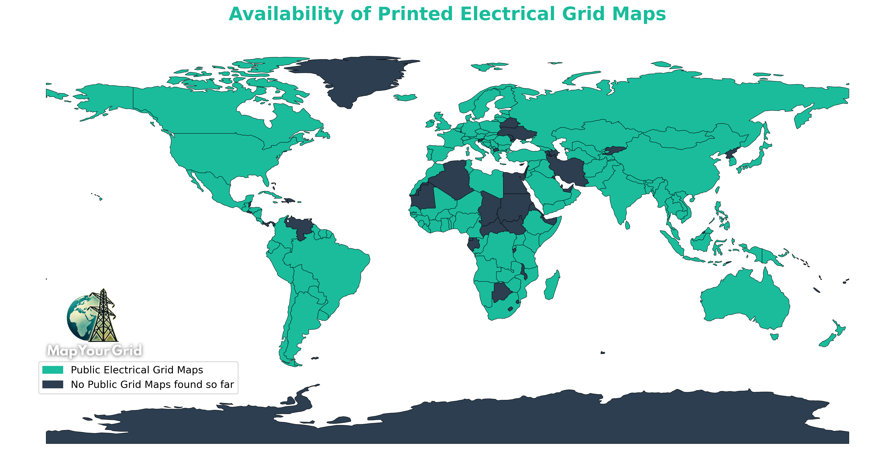

# Awesome Electrical Grid Mapping

<table>
<tr>
<td>
<b>A curated list of global electrical grid maps, datasets and resources.</b>
</td>
<td>

</td>
</tr>
</table>

<!-- COLLAPSE:question title="Why we've copiled these resources" open="true" -->
⚠️ The datasets, maps and all resources compiled here are used to estimate the grid coverage in OpenStreetMap and to find missing lines. Do not copy/paste data from these maps directly into your OpenStreetMap layer. Each data point of the transmission network must be set manually and [verified](https://wiki.openstreetmap.org/wiki/Verifiability) with official satellite data provided by the OpenStreetMap community.
<!-- END COLLAPSE -->
<!-- COLLAPSE:tip title="Join the #MapYourGrid initiative" open="true"-->
Get started with transmission grid mapping in OpenStreetMap by checking out our [Starter Kit Tutorial](https://mapyourgrid.org/starter-kit/) and [our community discord channel](https://discord.gg/a5znpdFWfD).
<!-- END COLLAPSE -->
<!-- COLLAPSE:note title="A link is not working ?" open="true" -->
If a resource link is broken, or you find a map with a broken link that you'd like to add to this list, try it on the [Internet Archive](https://web.archive.org/). This even works for PDFs and other files.
<!-- END COLLAPSE -->

<!-- ⚠️⚠️⚠️ If you'd like to contribute to this list, please follow this format : 
* (Country or Region) [Title](link) (year of publication or last update : YYYY) (license type) (tags in separate parentheses : capacitydata | dataset | map | report) ⚠️⚠️⚠️ -->

<!-- TABS:start -->
<!-- TAB:Grid Explorer -->
## Grid Explorer
<!-- COLLAPSE:info title="Global Data Catalogs" -->
### Global Data Catalogs 
* [Open Infrastructure Map](https://openinframap.org/) [[Code](https://github.com/openinframap/openinframap)] (map)
* [GridFinder](https://gridfinder.rdrn.me/) [[Code](https://github.com/carderne/gridfinder)] (map)
* [FLOSM Power Grid](https://www.flosm.org/en/powergrid.html) (odbl) (map)
* [Electricity Maps - Electricity Grid Carbon Emissions](https://app.electricitymaps.com/) [[Code](https://github.com/electricitymaps/electricitymaps-contrib)] (map) 
* [Global Energy Monitor](https://globalenergymonitor.org/) (cc-by-4.0) (map) (dataset)
* [The Global Transmission Database](https://github.com/Electricity-Transmission-Database/electricity-transmission-database) [Code](https://github.com/Electricity-Transmission-Database/electricity-transmission-database) (mit) (dataset) (capacitydata)
* [HVDC World Global Map](https://www.hvdcworld.com/hvdc-map) (map)
* [ENERGYDATA.INFO -  Open Data and Analytics for a sustainable energy future](https://energydata.info/) (dataset)
* [Transmission network datasets wiki of openmod](https://wiki.openmod-initiative.org/wiki/Transmission_network_datasets) (cc-by-4.0) (dataset)
* [Open Energy Platform Grid Data](https://openenergyplatform.org/dataedit/view/grid) (odbl) (dataset)
* [Electricitymaps Data Sources](https://github.com/electricitymaps/electricitymaps-contrib/blob/master/DATA_SOURCES.md) (mit) (agpl-3.0) (dataset)
* [openAfrica](https://www.open.africa/) (gpl-3.0) (dataset)
* [Global Renewables Watch](https://www.globalrenewableswatch.org/) (map) (dataset)
* [The Utility Performance and Behavior Today (UPBEAT) platform - WorldBank](https://utilityperformance.energydata.info/utilities/) (cc-by-4.0) (dataset)
* [Latin America UPME electricity infraestructure map](https://sig.upme.gov.co/portal/apps/experiencebuilder/experience/?id=1cb0108edbcb48aca70a838db3db6d89&page=Infraestructura-el%C3%A9ctrica&views=LATAM) (map)
* [Energy Access Explorer](https://www.energyaccessexplorer.org/) (mit) (dataset) (map)
* [DOE Global Energy Storage Database](https://gesdb.sandia.gov/projects.html) (dataset)

<!-- END COLLAPSE -->

<!-- COLLAPSE:info title="Africa" -->
### Africa
#### Cross-border projets and resources
* [Africa Electricity Grids Explorer](https://africagrid.energydata.info/) (map)
* [Central Africa Power Pool](https://www.peac-sig.org/en/systeme-d-information-3.html)
* [Africa Knowledge Platform-European Comission](https://africa-knowledge-platform.ec.europa.eu/explore_maps)
* [ECOWAS Region - Existing and Planned Transmission Grid](https://energydata.info/dataset/transmission-grid-ecowas-region) (2021) (CC-BY-SA 4.0) (dataset)
* [GRID3 NGA - Other POI: Energy and Electricity Substations](https://data.grid3.org/datasets/GRID3::grid3-nga-other-poi-energy-and-electricity-substations/explore)
* [Gulf Cooperation Council Interconnection Authority](https://gccia.com.sa/gccia-grid/our-existing-network/) (report) 
* [Med-TSO - Mediterranean](https://med-tso.org/en/map-of-the-interconnected-electricity-transmission-networks-2024/) (2024) (map)
* [Plan d’Affaires Stratégique 2025-2028 du PEAC](https://peac-ac.org/wp-content/uploads/2025/02/plan-daffaires_PEAC_VF.pdf) (2024) (report)
* [Regional Electricity Interconnection of Africa](https://africa-eu-energy-partnership.org/regional-electricity-interconnection-and-market-integration-in-africa-is-taking-huge-strides-forward/) (2023) (map) (report)
* [Southern-Eastern Africa RE Zones](https://mapre.es.ucsb.edu/project/searez/) (2015) (proprietary) (map) (report)
* [West African Power Pool (WAPP)](https://www.ecowapp.org/sites/default/files/wapp_map_general_optimized.gif) (2017) (map)
* [West African Power Pool (WAPP)](https://www.ecowapp.org/sites/default/files/wapp_final_map_0.pdf) (2019) (map)
* [OMVG - Gambia, Guinea, Guinea-Bissau, Senegal - Interconnector line 225 kV, 2020](https://www.pe-omvg.org/sites/default/files/2020-12/201103_FR_BULLETIN%20PE%20OMVG_210x297mm_12%20pages_PRINT_FR.pdf)
* [OMVG - Gambia, Guinea, Guinea-Bissau, Senegal - Interconnector line 225 kV - Action plan](https://www.omvg.org/sites/default/files/document/2023-01/par-lignes-senegal-version-finale-sans-annexes-11_03_2019.pdf) (2019) (report)

#### National-level projets and resources
* (Angola) [Rapid Assessment and Gap Analysis](https://www.seforall.org/sites/default/files/l/2015/05/Angola_RAGA.pdf) (2015) (report)
* (Angola) [Mapa de Rede](http://www.rnt.co.ao/mapa-da-rede/) (2024) (map)
* (Benin;Burkina Faso;Côte d'Ivoire;Ghana;Guinea;Guinea-Bissau;Liberia;Mali;Niger;Nigeria;Senegal;Sierra Leone;Togo;Gambia) [West African Power Pool (WAPP)](https://www.ecowapp.org/sites/default/files/wapp_map_general_optimized.gif) (2017) (map)
* (Botswana) [Botswana Power Corporation - Generation Facilities, Transmission, Distribution grids](https://www.bpc.bw/our-customer-base/) (proprietary) (map)
* (Botswana) [Transmission Grid Projects](https://www.bpc.bw/portfolio-items/gaborone-power-project/) (report) (proprietary)
* (Cameroon) [Plan Directeur d’Electrification Rurale](https://rise.esmap.org/data/files/library/cameroon/Electricity%20Access/Cameroon_PDER.pdf)
* (Cameroon) [Eneo Electrical Map](https://eneocameroon.cm/index.php/en/l-entreprise-a-propos-d-eneo-l-entreprise-en/l-entreprise-a-propos-d-eneo-notre-carte-electrique-en)(2024)(map)
* (Côte d'Ivoire) [Projects and planning for the Electrical System](https://www.cinergies.ci/realisations-et-projets-planifies/) (2020) (proprietary) (map)
* (Democratic Republic of the Congo) [Regulator Report 2024](https://are.gouv.cd/rapport-annuel-2024/) (2024) (proprietary) (report) (capacitydata)
* (Eswatini) [Energydata Eswatini Substations 2021](https://energydata.info/dataset/eswatini-substations) (2022) (dataset)
* (Eswatini) [Energydata Eswatini Grid Network 2022](https://energydata.info/dataset/eswatini-grid-network) (2023) (dataset)
* (Eswatini) [Energydata Eswatini Electricity Transmission Network 2009](https://energydata.info/dataset/swaziland-electricity-transmission-network) (2023) (CC-BY-4.0) (dataset)
* (Eswatini) [Energydata Eswatini Power Plants](https://energydata.info/dataset/swaziland-power-plants) (2023) (CC-BY-SA 4.0) (dataset)
* (Ethiopia) [Electric Power](https://www.eep.com.et/?page_id=781) (dataset)
* (Ethiopia;Somalia) [Energydata Somalia Ethiopia interconnection](https://energydata.info/dataset/somalia-ethiopia-interconnection) (2023) (CC-BY-4.0) (dataset)
* (Gabon) [Energydata Gabon Power Plants](https://energydata.info/dataset/gabon-power-plants) (2023) (CC-BY-SA 4.0) (dataset)
* (Gabon) [Energydata Gabon Electricity Transmission Network 2009](https://energydata.info/dataset/gabon-electricity-transmission-network)  (2024) (CC-BY-4.0) (dataset)
* (Ghana) [THE ENERGY YEAR - Ghana’s Transmission System](https://d3jmgibn6sgz2k.cloudfront.net/wp-content/uploads/2022/02/03083842/The-Energy-Year-Ghana-2022-GRIDCo-Map.pdf) (2022) (proprietary) (map)
* (Ghana) [Electricity Supply Plan for the Ghana Power System](https://gridcogh.com/wp-content/uploads/2022/07/2022-Electricity_Supply_Plan-1.pdf) (2022) (report)
* (Guinea) [Energydata Guinea Electricity Transmission Network 2014](https://energydata.info/dataset/guinea-electricity-transmission-network-2014) (2014) (CC-BY-SA 4.0) (dataset)
* (Kenya) [Energydata Kenya Electricity Network](https://energydata.info/dataset/kenya-kenya-electricity-network) (2021) (cc0) (dataset)
* (Kenya) [Energydata Kenya Transmission Stations](https://energydata.info/dataset/kenya-transmission-stations) (2020) (cc0) (dataset)
* (Kenya) [Energydata Kenya Primary Substations](https://energydata.info/dataset/kenya-primary-substations) (2024) (CC-BY-4.0) (dataset)
* (Kenya) [KETRACO Transmission Master Plan 2023/2042](https://drive.google.com/file/d/1p_j3pJT4sdOcxo1Msfo180yLEQYjj8hA/view) (2023) (report) (map)
* (Liberia) [Energydata Liberia Electric Substations](https://energydata.info/dataset/liberia-electric-substations) (2021) (CC-BY-4.0) (dataset)
* (Liberia) [Energydata Liberia Electricity Transmission Network](https://energydata.info/dataset/liberia-electricity-transmission-network-2023) (2023) (cc-by-nc-4.0) (dataset)
* (Libya) [National Grid](https://www.geni.org/globalenergy/library/national_energy_grid/libya/index.shtml)(map)
* (Madagascar) [Energydata Madagascar planned transmission network 2017](https://energydata.info/dataset/madagascar-planned-transmission-network-2017) (2017) (cc0) (dataset)
* (Madagascar) [Planification géospatiale-map page 23](https://meh.mg/wp-content/uploads/2022/07/R5-Planification-Geospatiale-Rapport-final-V12-Annexe.pdf)(2022)(report)(map)
* (Mauritania) [Energydata Mauritania Existing Grid](https://energydata.info/dataset/mauritania-existing-grid) (2023) (cc0) (dataset)
* (Mauritania)[Annual Report with Map TSO](https://somelec.mr/sites/default/files/TDR%20Audit_annuel_de_performance_ES_2025_2026_2027.pdf)(2025) (report)
* (Morocco) [Electricity Transmission Network](https://energydata.info/dataset/morocco-electricity-transmission-network) (2025) (CC-BY-4.0) (dataset)
* (Mozambique) [Eletricidade de Moçambique - Priorities 2021-2030](https://www.edm.co.mz/projectos) (2022) (report)
* (Mozambique) [ANNUAL STATISTICAL REPORT](https://www.edm.flexibihost.com/en/document/reports/relat%C3%B3rio-anual-de-estat%C3%ADsticaannual-estatistical-report) (2024) (report) (map)
* (Namibia) [NamPower’s 2024 Integrated Annual Report](https://www.nampower.com.na/public/docs/annual-reports/NamPower_Integrated_Annual_Report_2024.pdf) (2024) (report)
* (Nigeria) [Dataset for the Nigerian 50-Bus 330 kV Power Grid](https://zenodo.org/records/12091189) (2017) (CC-BY-4.0) (dataset) (capacitydata)
* (Nigeria) [Details of Power Plants Existing and Planned - 2020 to 2030](https://web.archive.org/web/20220826200109/https://data.nigeriase4all.gov.ng/documents/357/download) (dataset)
* (Nigeria) [Substations dataset](https://data.grid3.org/datasets/4eed11fbbdd34779be446296208c6cbe_0/explore?location=7.753760%2C7.255227%2C6.99) (2025) (CC-BY-4.0) (map) (dataset) 
* (Nigeria) [Nigeriase4all - Power sector data explorer](https://apps.nigeriase4all.gov.ng/power-sector?grid_buffer=4.5&state=oyo) (map)
* (Nigeria) [THE ENERGY YEAR - Nigeria Grid Map](https://d3jmgibn6sgz2k.cloudfront.net/wp-content/uploads/2021/11/09164603/TCN_Nigeria21.pdf) (2021) (map) 
* (Nigeria) [Transmission Company - Offical Grid Map](https://nsong.org/App_Themes/Blue/images/NationalGrid.png) (map)
* (Republic of the Congo) [Schéma Directeur Transport](https://rise.esmap.org/data/files/library/congo%2C-dem.-rep./Electricity%20Access/Congo_Schemas%20directeur%20de%20transport_2016.pdf)
* (Rwanda) [Transmission Development Plan 2023-2030](https://www.reg.rw/fileadmin/user_upload/Updated_Rwanda_Electricity_Transmission_Development_Plan_-_June_2023.pdf) (2023) (report)
* (Rwanda) [Energydata Rwanda Power plants](https://energydata.info/dataset/rwanda-power-plants) (2018) (cc0) (dataset)
* (Rwanda) [Map](https://www.reg.rw/what-we-do/transmission/)(map)
* (Senegal) [Power Grid Map of Senegal](https://www.geosenegal.gouv.sn/carte-du-reseau-electrique-du-senegal.html) (2018) (map)
* (Somalia) [Mini-Grids With MV Lines](https://energydata.info/dataset/somalia-mini-grids-with-mv-lines) (2023) (cc-by-4.0) (dataset)
* (Somalia) [Energydata Somalia Transmission Backbone](https://energydata.info/dataset/somalia-transmission-backbone) (2023) (cc-by-4.0) (dataset)
* (Somalia) [Energydata Somalia Minigrids](https://energydata.info/dataset/somalia-minigrids) (2023) (cc-by-4.0) (dataset)
* (South Africa) [National Transmission Company - Generation Connection Capacity Assessment](https://app.powerbi.com/view?r=eyJrIjoiMGY3ODI4NWQtMWZkMS00YjJjLTk1YTUtOWEyYTk0NDdhMWQ3IiwidCI6IjkzYWVkYmRjLWNjNjctNDY1Mi1hYTEyLWQyNTBhODc2YWU3OSIsImMiOjh9) (2025) (dataset) (capacitydata)
* (South Africa) [National Transmission Company - Transmission Development Plan 2025](https://www.ntcsa.co.za/wp-content/uploads/2024/11/TDP2024_Public_Forum_Presentation_30Oct2024_Final_Pack_Rev1.pdf) (2024) (report)
* (Tanzania) [Power System master Plan 2020](https://www.tanesco.co.tz/attachments/investments/investment_reports/WiYQwYs5IKHKkgiIEGW8WS0wqf_nsG3K_POWER%20SYSTEM%20MASTER%20PLAN%202020%20UPDATE_2023_09_12_07_39_38.pdf) (2023) (report) (capacitydata)
* (Tanzania) [Energydata Tanzania](https://energydata.info/dataset/?q=Tanzania) (dataset)
* (Tanzania) [Tracking SDG 7 - United Republic of Tanzania](https://trackingsdg7.esmap.org/country/united-republic-tanzania) (report)
* (Tanzania) [RISE Esmap](https://rise.esmap.org/country/tanzania) (report)
* (Tanzania) [Improving Sustainability of the Power Sector and Accelerating Electricity Access: A Proposed WBG Roadmap](https://documents1.worldbank.org/curated/en/099061424235032922/pdf/P17965415d283b02819dcb198dabea9914a.pdf
* (Tanzania) [Power plants](https://energydata.info/dataset/tanzania---power-plants--2015-) (2018) (cc0) (dataset)
* (Tunisia) [Data Collection Survey On Power Sector - 2022](https://openjicareport.jica.go.jp/pdf/12342283.pdf) (2022) (report)
* (Uganda) [GIS for the Energy Sector](https://energy-gis.ug/gis-maps) (maps)
* (Uganda) [Transmission Lines 2017 GeoJSON](https://energydata.info/dataset/uganda-electricity-transmission-network-2017/resource/e2643a0e-bad9-4644-b925-f6bc3e3f1db9) (2017) (odbl) (dataset)
* (Uganda) [Energydata Transmission Substations 2016](https://energydata.info/dataset/transmission-substations-2016-operational) (2019) (cc-by-4.0) (dataset) 
* (Zambia) [Integrated Resource Plan](https://www.moe.gov.zm/wp-content/uploads/2023/12/IRP-Summary-Report_2023.12.05_Final.pdf) (2023) (report)
* (Zambia) [Energydata Zambia Overhead MV Distribution Lines](https://energydata.info/dataset/zambia-overhead-mv-distribution-lines) (2022) (cc0) (dataset)
* (Zambia) [Energydata Zambia Base case grid extensions](https://energydata.info/dataset/zambia-base-case-grid-extensions) (2022) (cc0) (dataset)
* (Zambia) [Energydata Zambia Power plants](https://energydata.info/dataset/zambia---power-plants--2015-) (2018) (cc0) (dataset)
* (Zambia) [Energydata Zambia Electrical Transformers And Substations](https://energydata.info/dataset/zambia-electrical-transformers-and-substations-point) (2023) (cc-by-4.0) (dataset)
* (Zambia) [Energydata Zambia Electricity Transmission Network](https://energydata.info/dataset/zambia-electricity-transmission-network-2014) (2014) (cc-by-4.0) (dataset)
* (Zimbabwe) [Energy Profile](https://www.zvei.org/fileadmin/user_upload/Themen/Maerkte_Recht/Aussenwirtschaft/Afrika/Simbabwe/Simbabwe-EZ-Elektro-Energie-Rohstoffe/Energy_Profile_Zimbabwe.pdf) (report)
* (Zimbabwe)[GIS Power Plants](https://www.arcgis.com/apps/dashboards/9aed668320794218814af40b946d8184)
<!-- END COLLAPSE -->

<!-- COLLAPSE:info title="Asia" -->
### Asia
#### Cross-border projets and resources
* (Central Asia) [United Nations - Energy Connectivity in Central Asia - An inventory of existing national energy systems](https://unece.org/sites/default/files/2024-02/EN_Energy%20Connectivity%20in%20Central%20Asia_V2.pdf) (2023) (report)
* (Kazakhstan;Kyrgyzstan;Tajikistan;Turkmenistan) [Cooperation of energy systems in Central Asia](https://www.newscentralasia.net/2024/06/13/sotrudnichestvo-energeticheskikh-sistem-v-tsentralnoy-azii) (2024) (report)
* (Mekong Region) [OpenDevelopment Mekong Map Explorer](https://data.opendevelopmentmekong.net/map-explorer) (cc-by-sa-4.0) (dataset) (map) (report)
* (South-East Asia) [ASEAN Energy Database](https://www.arcgis.com/apps/View/index.html?appid=a840b350e8744ef6a523abd361f10738) (map)
* (South-East Asia) [ASEAN Power Grid Interconnections Project Profiles](https://aseanenergy.org/wp-content/uploads/2024/11/ASEAN-Power-Grid-Interconnections-Project-Profiles.pdf) (2024) (capacitydata) (report) 

#### National-level projets and resources
* (Afghanistan) [Current and planned transmission grid - High Res](https://web.archive.org/web/20250219203422im_/http://aeic.af/storage/Map/01HYFMF9FHM7J51TRM6D2JJ8N5.jpg) (2024) (cc-by-4.0) (map)
* (Afghanistan) [Current and planned transmission grid](https://www.researchgate.net/figure/The-current-and-planned-transmission-grid-of-Afghanistan-19_fig6_382678716) (2024) (cc-by-4.0) (map)
* (Armenia) [Armenian Energy Agency Maps](https://energyagency.am/en/page_pdf/qartez) (maps)
* (Armenia) [Energy Sector Development Strategic Program to 2040](https://policy.asiapacificenergy.org/sites/default/files/Energy%20Sector%20Development%20Strategic%20Program%20to%202040%20.pdf?utm_source=chatgpt.com) (2021) (report)
* (Bangladesh) [Power Grid Company of Bangladesh](https://pgcb.portal.gov.bd/sites/default/files/files/pgcb.portal.gov.bd/download/4f660a85_ef1d_4be7_8944_16562129c3f1/2020-07-27-09-44-6c67edf0a0e3c9debd68cd95dece815b.pdf) (proprietary) (map)
* (Bhutan) [Transmission network](https://sarepenergy.net/wp-content/uploads/2023/06/Presentation-on-Overview-of-Electricity-Transmission-Planning-in-Bhutan-by-Mr.-Kinley-Jamtsho-Transmission-Executive-Engineer-DoEMoENR-Bhutan_-SAGE-RIS-USAID-SAREP_18th-June-2023.pdf) (2023) (report)
* (Bhutan)[Report](https://openjicareport.jica.go.jp/pdf/12326856_01.pdf) (2019) (report)
* (Cambodia) [Cambodia’s PDP Transmission Plan](https://www.adb.org/sites/default/files/project-documents/52096/52096-001-tacr-en_0.pdf) (2024) (report)
* (Cambodia) [Energy Sector Assessment, Strategy, and Road Map](https://www.adb.org/sites/default/files/institutional-document/479941/cambodia-energy-assessment-road-map.pdf) (2018) (report)
* (Cambodia) [OpenDevelopment Map Explorer](https://data.opendevelopmentcambodia.net/map-explorer) (cc-by-sa-4.0) (capacitydata) (dataset) (map)
* (Cambodia) [Transmission Map, page 71](https://admin.edc.com.kh/images/annuallyreport/def65040b39aa223f54ff3d577b336e3.pdf) (report) (map)
* (China) [Baker Institute Energy Map](https://www.bakerinstitute.org/chinas-energy-infrastructure) (2024) (capacitydata) (map)
* (China) [Electrical Grid by Regions](https://greenwich.envisioncn.com/docs/greenwich-dg/en/_static/frozen_area.pdf) (2013) (map)
* (Georgia) [GSE Ten Year development plan](https://gse.com.ge/communication/Publications/Ten-Year-Network-Development-Plan-of-Georgia) (2024) (capacitydata) (map) (report)
* (Georgia) [GSE Power flow and interconnectors](https://www.gse.com.ge/for-customers/data-from-the-power-system/power-flow) (map)
* (Georgia) [Power transmission lines of JSC UES SAKRUSENERGO](https://sakrusenergo.ge/en/%e1%83%94%e1%83%9a%e1%83%94%e1%83%a5%e1%83%a2%e1%83%a0%e1%83%9d%e1%83%92%e1%83%90%e1%83%93%e1%83%90%e1%83%9b%e1%83%aa%e1%83%94%e1%83%9b%e1%83%94%e1%83%91%e1%83%98/) (proprietary) (map)
* (India) [Energy Map of India - Based on OpenStreetMap Data](https://vedas.sac.gov.in/energymap/view/powergis.jsp) (map)
* (India) [National Electricity Plan](https://cea.nic.in/wp-content/uploads/psp___a_i/2024/01/Draft_NEP_Vol_II.pdf) (2023) (capacitydata) (report)
* (India) [POWER MAP OF INDIA](https://www.powergrid.in/sites/default/files/inline-files/POWERGRID_All%20India%20Power%20Map_Aug%202021.pdf) (2021) (map)
* (India) [POWER MAP OF EASTERN REGION](https://cea.nic.in/wp-content/uploads/2020/03/)
* (India) [Power Transmission Corporation Limited, Government of Uttar Prades](https://upptcl.org/upptcl/en/page/transmission-maps) (2025) (map)
* (India) [Central Electricity Authority](https://cea.nic.in/transmission-reports/?lang=en) (2025) (report) (capacitydata)
* (India) [POWER MAP OF GOA](https://goaelectricity.gov.in/Regulations/POWER%20MAP%20OF%20GOA%20UPDATED%20%2001%20Nov%202022.pdf) (2022) (map)
* (India) (Karnataka) [GRID MAP OF KARNATAKA](https://web.archive.org/web/20220802124435/https://kptcl.karnataka.gov.in/storage/pdf-files/epra/1%20GRIDMAP_2018.pdf) (2018) (map)
* (India) (Kerala) [GRID MAP OF KERALA](http://pse.kseb.in/PSEHome/resources/gridnew/index.html) (2024) (map)
* (India) (Odisha) [Odisha Transmission Grid Map](https://www.sldcorissa.org.in/Writereaddata/Downloads/Trans_Map-OPTCL.pdf) (2020) (map)
* (India) (Telangana) [Telangana Transmission grid map](https://pbs.twimg.com/media/GiMB8nqbUAA1fGP?format=jpg&name=4096x4096)
* (India) (Maharashtra) [Maharashtra](https://www.mahatransco.in/uploads/docs/MSETCL%20Network%20Map.pdf) (2021) (map)
* (India) (Maharashtra) [MAHARASHTRA STATE ELECTRICITY TRANSMISSION CO. LTD](https://www.mahatransco.in/information/details/power_map) (2024) (map)
* (India) (MADHYA PRADESH) [POWER MAP OF MADHYA PRADESH](https://www.wrpc.gov.in/allfile/261120240653302359Power%20Map%20(01.10.2024)%20MP.pdf) (2024) (map)
* (India) (Assam) [Transmission Network of Assam](https://www.aegcl.co.in/wp-content/uploads/2020/12/08082018-AEGCL-POWER-MAP-FINAL.pdf) (2020) (map)
* (India) (Tripura) [Tripura Power Map](https://tsecl.in/power_map#:~:text=Tripura%20State%20Electricity%20Corporation%20Limited) (2024) (map)
* (India) (Tripura) [POWER SYSTEM NETWORK Diagram](https://tsecl.in/sites/default/files/2024-09/Diagram.pdf)
* (India) (Delphi) [Delhi Transco Ltd](https://dtl.gov.in/Network.aspx) (2023) (map)
* (India) (Uttarakhand) [Transmission Map of PTCUL](https://ptcul.org/document/power-map-ptcul-26-sep-2024.pdf) (2024) (map)
* (India) (Uttarakhand) [POWER TRANSMISSION CORPORATION OF UTTARAKHAND LTD](https://ptcul.org/document/sld-ptcul-network-sep-2024.pdf) (2024) (map)
* (Indonesia) [Electrical substation in Indonesia](https://www.arcgis.com/home/item.html?id=c5507bca5a2a4da68db0c699e8b70e19) (2024) (cc-by-4.0) (map)
* (Indonesia) [Electricity Supply Business Plan 2021 - 2030](https://gatrik.esdm.go.id/assets/uploads/download_index/files/38622-ruptl-pln-2021-2030.pdf) (2021) (report)
* (Iran) [Map of the High Voltage Grid](https://www.cigre.org/userfiles/files/Community/NC/2018_National-power-system_Iran.pdf) (2018) (report)
* (Iraq) [Modeling the Power Grid Network of Iraq](https://www.researchgate.net/publication/366007793_Modeling_the_Power_Grid_Network_of_Iraq) (2022) (cc-by-4.0)(report)
* (Japan) [J-Power Group Integrated Report](https://www.jpower.co.jp/ir/pdf/rep2023/jpower_integrated2023_all.pdf) (2023) (report)
* (Japan) [OSW Project Areas & Transmission Lines in Japan](https://www.renewable-ei.org/statistics/offshoremap/?page=en) (capacitydata) (map)
* (Japan) [OCCTO - Organization for Cross-regional Coordination of Transmission Operators](https://www.occto.or.jp/access/link/mapping.html)  (capacitydata) (dataset) (report)
* (Jordan) [Electric System - National Electric Power Company](https://nepco.com.jo/en/JordanElecticSystem.aspx) (map)
* (Jordan) [MENA - Electricity Transmission Network 2018](https://energydata.info/dataset/jordan-electricity-transmission-network) (2018) (cc-by-4.0) (dataset)
* (Kazakhstan) [Electrical networks](https://www.kegoc.kz/electric-power/natsionalnaya-energosistema/%D0%9A%D0%B0%D1%80%D1%82%D0%B0%20%D1%81%D1%85%D0%B5%D0%BC%D0%B0%20%D0%95%D0%AD%D0%A1%20%D0%9A%D0%B0%D0%B7%D0%B0%D1%85%D1%81%D1%82%D0%B0%D0%BD%D0%B0-2025%20%D0%B4%D0%BB%D1%8F%20%D1%81%D0%B0%D0%B9%D1%82%D0%B0%20en.%20cdr.pdf) (2025) (map)
* (Kazakhstan) [MES branches (includes capacity data for lines in each regions docx)](https://www.kegoc.kz/en/about/struktura-kompanii/filialy-mes/?region0)(capacity)
* (Kyrgyzstan, Turkmenistan, Tajikistan, Uzbekistan) [Transmission Grid](https://kaktus.media/doc/444230_tyrkmenistan_bydet_davat_elektroenergiu_kyrgyzstany_gde_logika_mneniia_ekspertov.html) (2020) (map)
* (Laos) [Assessment of Electric Vehicle Penetration in the Lao People’s Democratic](https://www.eria.org/uploads/media/Research-Project-Report/RPR-2021-26/14_Chapter-5-Analysis-on-Impacts-to-the-Power-Sector.pdf) (2022) (report) 
* (Laos) [Energy Data Laos](https://energydata.info/dataset/laos-electricity-transmission-network-2005) (2005) (dataset)
* (Lebanon)[DATA COLLECTION SURVEY ON ELECTRICITY SECTOR IN LEBANON](https://openjicareport.jica.go.jp/pdf/1000051515_01.pdf) (2023) (report) (map) (capacities) (SLD)
* (Malaysia) [Sabah Energy Roadmap and Master Plan 2040](https://ecos.gov.my/sites/default/files/uploads/downloads/2023-09/SABAH%20ENERGY%20ROADMAP%20AND%20MASTER%20PLAN%202040%20%28SE-RAMP%202040%29.pdf) (2023) (proprietary) (report)
* (Malaysia) [Sarawak Power Generation and Network](https://www.sarawakenergy.com/assets/images/power-generation/map.png) (map)
* (Mongolia) [Overview of Energy/Electricity demand and Renewable energy potential](https://www.renewable-ei.org/images/pdf/20160525/Enebish_Namjil.pdf) (2016) (report)
* (Mongolia) [Map](https://www.transco.mn/intro/1)(map)
* (Myanmar) [Existing Power Grid and Under Construction Projects](https://www.moep.gov.mm/en/ignite/page/641) (2019) (map)
* (Myanmar) [Myanmar Information Management Unit](https://geonode.themimu.info/layers/?limit=100&offset=0) (2025) (dataset)
* (Nepal) [Nepal electricity authority annual report](https://www.nea.org.np/annual_report) (2024) (report)
* (Nepal) [Transmission System Development Plan](https://nepalindata.com/media/resources/items/15/bTransmission-System-Development-Plan-of-Nepal.pdf) (2018) (capacitydata) (report) 
* (Nepal) [NEPAL POWER TRANSMISSION NETWORK MAP](https://www.rpgcl.com/storage/listies/November2021/nepal-tranmission-network-map-revised1.pdf) (2021) (map)
* (Oman) [Oman - Report GIS Data Governance Is Key to OETC's Success](https://www.esri.com/en-us/lg/industry/electric-and-gas/stories/oetc-case-study) (2023) (map)
* (Pakistan) [Generation and Transmission System Expansion](https://eco.int/wp-content/uploads/2024/12/Annex-IX-Presentation-of-Pakistan.pdf) (2024) (report)
* (Pakistan) [Performance Evaluation Report of Transmission Companies 2023-24](https://nepra.org.pk/M&E/PER/Transmission/2024/Performance%20Evaluation%20Report%20of%20Transmission%20Companies%202023-24.pdf) (2024) (report)
* (Pakistan) [NTDC Revised Transmission Investment Plan FY 2023-2025](https://www.nepra.org.pk/Admission%20Notices/2023/10%20Oct/NTDC%20Revised%20Investment%20Plan.pdf) (2023) (report)
* (Pakistan) [NTDC TRANSMISSION SYSTEM EXPANSION PLAN](https://nepra.org.pk/Admission%20Notices/2024/05%20May/TSEP%202024-34%20Report.pdf) (2024) (report) 
* (Palestine) [Geomolg - Transmission Lines and Substations](https://geomolg.ps/L5/index.html?viewer=A3.V1) (map)
* (Papua New Guinea) [Energy Policy and Practice for Climate and People](https://www.jubileeaustralia.org/storage/app/uploads/public/63c/daa/f1f/63cdaaf1f37ff165892315.pdf) (2022) (cc-by-4.0) (report)
* (Papua New Guinea) [National Energy Policy report (includes a map)](https://nea.gov.pg/wp-content/uploads/2022/12/National-Energy-Policy-2017-2027.pdf)(2017)
* (Philippines) [Transmission Development Plan 2023-2040](https://web.archive.org/web/20250317060959/https://ngcp.ph/Attachment-Uploads/TDP%202023-2040%20Consultation%20Report-2023-06-15-07-54-06.pdf) (2023) (report)
* (Philippines) [Standard Line Diagram](https://www.ngcp.ph/Attachment-Uploads/TDP%202025-2050%20REPORT-2025-09-25-09-29-14.pdf)(2025)(report)
* (Russia) [ЛЭП России 2020 год](https://powerlines.one/#2.5/50/90) (2020) (open access) (map)
* (Saudi Arabia) [Unfolding Power Sector Reform: Features, Challenges and Opportunities for Market Integration](https://www.researchgate.net/publication/342412075_Saudi_Arabia's_Unfolding_Power_Sector_Reform_Features_Challenges_and_Opportunities_for_Market_Integration) (2020) (proprietary) (report) 
* (South Korea) [10th long-term transmission and substation facility plan established by KEPCO](https://www.e2news.com/news/articleView.html?idxno=253433) (2023) (map)
* (South Korea) [Transmission Map](https://www.e2news.com/news/articleView.html?idxno=236289) (2021) (map)
* (Sri Lanka) [Transmission Grid ](https://www.ceb.lk/transmission/en) (2023) (map) 
* (Syria) [Electricity Sector After a Decade of War: A Comprehensive Assessment](https://cadmus.eui.eu/server/api/core/bitstreams/c78454ff-21c8-5b4f-8b38-6aec738fa0d7/content) (2021) (cc-by-4.0) (report)
* (Syria) [Infrastructure Maps - Based on OpenStreetMap](https://data.humdata.org/dataset/syria-infrastructure-maps-power-line-water-way-dam-highway)  (2020) (dataset)
* (Taiwan) [Taipower's Power Plants and Power Grid Map](https://www.taipower.com.tw/2764/2809/2814/25012/normalPost) (2025) (map)
* (Thailand) [Renewable Grid Integration Assessment](https://www.oecd.org/content/dam/oecd/en/publications/reports/2018/11/thailand-renewable-grid-integration-assessment_g1g993de/9789264308213-en.pdf) (2017) (report)
* (Turkey) [Turkey's Power Grid](https://www.climatescorecard.org/2023/01/turkeys-power-grid/) (2023) (map)
* (Turkmenistan) [ADB Project](https://www.adb.org/sites/default/files/project-documents/49370/49370-002-sddr-en.pdf) (map)
* (Uzbekistan) [Electricity Sector Transformation and Resilient Transmission](https://documents1.worldbank.org/curated/en/184411624932251299/pdf/Uzbekistan-Electricity-Sector-Transformation-and-Resilient-Transmission-Project.pdf) (2021) (report)
* (Uzbekistan) [Energydata Uzbekistan](https://energydata.info/dataset/uzbekistan-electricity-transmission-network) (2016) (dataset)
* (Vietnam) [Vietnam Electricity](https://en.evn.com.vn/userfile/files/EVNAnnualReport2022-2023-20241115110735330.pdf) (2023) (report)
* (Yemen) [Energydata Yemen Electricity Transmission Network](https://energydata.info/dataset/yemen-electricity-transmission-network-2017) (2016) (dataset)
* (Yemen) [Maps](https://moee-ye.com/site-ar/%d8%a7%d9%84%d9%85%d8%ae%d8%b7%d8%b7%d8%a7%d8%aa/)(map)
<!-- END COLLAPSE -->

<!-- COLLAPSE:info title="Australia and New Zealand" -->
### Australia and New Zealand
* (Australia) [Electricity Transmission Lines - Digital Atlas](https://digital.atlas.gov.au/datasets/digitalatlas::electricity-transmission-lines/explore) (2025) (cc-by-4.0) (dataset) (map)
* (Australia) [Geoscience Australia - National Electricity Transmission Substations](https://data.gov.au/data/dataset/au-govt-ga-national-electricity-transmission-substations-2017-na) (2017) (dataset) 
* (Australia) [Transgrid - Eastern Australia](https://tapr.transgrid.com.au/) (map)
* (Australia) [Queensland - NetworkLoad Capacity](https://www.ergon.com.au/network/about-us/company-reports%2C-plans-and-charters/network-load-capacity-map) (map)
* (Australia) [Western Australia Network Capacity Mapping Tool](https://westernpower.maps.arcgis.com/apps/webappviewer/index.html?id=21af5edc59034456b59c35be31365cdf) (2025) (map)
* (Australia) [Network Map Rosetta](https://renewables.networkmap.energy/) (map)
* (New Zealand) [Transpower New Zealand Ltd Transmission Lines](https://data-transpower.opendata.arcgis.com/datasets/0c8db240553f47b5844bdc2eb1146b9b_0/explore) (2025) (cc-by-4.0) (dataset) (map)
* (New Zealand) [Transpower Substations NZ](https://github.com/alltheplaces/alltheplaces/blob/master/locations/spiders/infrastructure/transpower_substations_nz.py) (mit) (dataset)
* (New Zealand) [Powerco Zone Substations NZ](https://github.com/alltheplaces/alltheplaces/blob/master/locations/spiders/infrastructure/powerco_zone_substations_nz.py) (mit) (dataset)
<!-- END COLLAPSE -->

<!-- COLLAPSE:info title="Europe"-->
### Europe
#### Cross-border projets and resources
* [ENTSO-E_Grid_Map_Continental_Europe](https://eepublicdownloads.entsoe.eu/clean-documents/Publications/maps/2024/ENTSOE_Grid_Map_Continental_Europe.pdf) (map)
* [ENTSO-E Transmission System Map](https://www.entsoe.eu/data/map/) (map)
* [European Grid Capacity Maps](https://www.gridcapacitymaps.eu/) (map)
* [European Energy Storage Inventory](https://ses.jrc.ec.europa.eu/storage-inventory-maps) (2025) (map) (dataset)
* [JAO Static Grid Model](https://www.jao.eu/sites/default/files/static-grid/) (capacitydata) (map)
* [50Herz - Static Grid Model](https://web.archive.org/web/20250317194153/https://www.50hertz.com/de/Transparenz/Kennzahlen/Netzdaten/StatischesNetzmodell) (2023) (map)
* (Albania;Bosnia & Herzegovina;Kosovo;North Macedonia;Montenegro;Serbia) [Transmission grid in the Western Balkans](https://wb6energyprospect.com/maps.php?mapa=6) (2025) (proprietary) (map)
* (Finland;Norway:Sweden) [Svenska kraftnät](https://www.svk.se/en/national-grid/map-of-the-national-grid/) (2025) (map)
* (Finland;Norway:Sweden) [Nordic Grid Development Perspective](https://www.svk.se/siteassets/om-oss/rapporter/2023/svk_ngpd2023.pdf) (2023) (report)

#### National-level projets and resources
* (Albania) [Albania Transmission system](https://ost.al/en/transmission-system/description-of-the-transmission-system/) (proprietary) (capacitydata) (map) (report)
* (Austria) [Grid Capacity](https://www.ebutilities.at/verfuegbare-netzanschlusskapazitaeten)  (proprietary) (capacitydata) (map)
* (Belgium) [High-voltage transmission lines](https://www.elia.be/en/infrastructure-and-projects/our-infrastructure) (2023) (proprietary) (map)
* (Bosnia-Herzegovina) [Map of EES 2024](https://www.derk.ba/en/ees-bih/ees-map) (2024) (proprietary) (map)
* (Bosnia-Herzegovina) [NOS-BiH Transmission grid development plan 2021-2030](https://www.nosbih.ba/files/2021/03/20210311-lat-Dugorocni-plan-razvoja-prenosne-mreze-2021-2030-Knjiga-1.pdf) (2021) (report)
* (Bosnia-Herzegovina) [NOS-BiH Real-time capacity grid of Bosnian interconnectors](https://www.nosbih.ba/hr/ees/ace/) (2025) (map)
* (Bosnia-Herzegovina) [NOS-BiH Multiple studies and analysis of power generators, network stability, renewables](https://www.nosbih.ba/en/dokumenti/studije-i-analize/) (report)
* (Bosnia-Herzegovina) [NOS-BiH Indicative Plan for Power Generation Development 2026–2035](https://www.nosbih.ba/files/2025/07/20250702-lat-Indikativni-plan-razvoja-proizvodnje-2026-2035.pdf) (2025) (capacitydata) (report)
* (Bosnia-Herzegovina) [NOS-BiH Long-Term Development Plan of the Transmission Network 2021–2030 - book 1](https://www.nosbih.ba/files/2021/03/20210311-lat-Dugorocni-plan-razvoja-prenosne-mreze-2021-2030-Knjiga-1.pdf) (2021) (capacitydata) (report)
* (Bosnia-Herzegovina) [NOS-BiH Long-Term Development Plan of the Transmission Network 2021–2030 - book 2](https://www.nosbih.ba/files/2021/03/20210311-lat-Dugorocni-plan-razvoja-prenosne-mreze-2021-2030-Knjiga-2.pdf) (2021) (capacitydata) (report)
* (Bulgaria) [Electricity Production & Transmission Network](https://bgenh.com/en/page/47/Electricity.html) (proprietary) (map)
* (Bulgaria) [Electricity trasnsmission system](https://www.eso.bg/doc?13) (proprietary) (map)
* (Croatia) [Power transmission scheme](https://www.hops.hr/en/system-scheme) (2020) (map)
* (Cyprus) [Cyprus Grid - Electricity Generation Data](https://cyprusgrid.com/) (2025) (proprietary) (capacitydata) (report)
* (Cyprus) [Transmission Substations Dataset](https://www.arcgis.com/home/item.html?id=3c33a4647de3416e8f21574ab8a4a0a1) (2024) (dataset) (map)
* (Cyprus) [Integration of a high share of variable RES in the Cyprus power system - list of substation names](https://www.energy.gov.cy/assets/modules/wnp/articles/202307/226/docs/cyprus_resgrid_summary_v16.pdf)(2023) (report)
* (Czechia) [Transmission and Distribution Grid Data](https://www.ote-cr.cz/cs/statistika/elektrizacni-soustava-cr.png) (2020) (map)
* (Czechia) [Transmission Grid TSO map](https://www.ceps.cz/en/transmission-system-data)(map)
* (Czechia) [EGD Grid map](https://www.egd.cz/sites/default/files/2024-12/schema-siti-400-220-a-110-kv-v-oblasti-pusobnosti-final.pdf)(2024)(map)
* (Czechia) [EGD DSO Capacity data for 110kv](https://www.egd.cz/sites/default/files/2024-12/volna-distribucni-kapacita-distribucnich-siti-eg.d-a.s-pro-rok-2024_final.pdf)(2024)(data)
* (Denmark) [Connection Points in the Electricity Grid and Voltage Levels](https://www.energidataservice.dk/tso-electricity/ConnectionPointsInGrid) (2024) (cc-by-4.0) (dataset)
* (Denmark) [Grid Capacity Map TSO-Substations geolocations](https://www.energidataservice.dk/tso-electricity/GridCapacityMapTSO)(2025)(dataset)
* (Denmark) [Grid Capacity](https://storymaps.arcgis.com/stories/eb5b387e376f49b8996d5e7c47fbdd37) (dataset) (report)
* (Denmark) [Map](https://en.energinet.dk/media/f3lpr5du/jke-danmark-stadie-2020-uk.jpg)(2020)(map)
* (Estonia) [Capacity Map](https://elering.ee/) (map)
* (Estonia) [Electricity Grid Development Plan 2025-2034](https://elering.ee/sites/default/files/public/elekter/elektris%C3%BCsteem/Eesti%20elektriu%CC%88lekandevo%CC%83rgu%20arengukava%202025-2034.pdf) (2025) (report)
* (Estonia) [Land and Spatial Development](https://xgis.maaamet.ee/xgis2/page/link/15XS10wa)
* (Finland) [Grid Capacity](https://experience.arcgis.com/experience/4c3f68b70a574a0e9ec0f9837a187542/page/Kulutuskapasiteetti) (map) 
* (France) [Structural french grid data with detailed topology time series](https://huggingface.co/datasets/OpenSynth/D-GITT-RTE7000-2021) (2021) (cc-by-sa-4.0)
* (Germany) [Uebertragungsnetz.de - Germany Grid Live Data](https://www.uebertragungsnetz.de/) (map)
* (Greece) [Independent Power Transmission Operator - Grid Map](https://www.admie.gr/en/grid/description/lines-map) (map) 
* (Hungary) [Electricity infrastructure](https://www.iea.org/articles/hungary-electricity-security-policy) (2022) (cc-by-4.0) (map) (report)
* (Hungary) [Mavir TSO map]](https://www.mavir.hu/web/mavir-en)(map)
* (Iceland) [Landsnet - Transmission and Distribution Grid](https://www.map.is/landsnet/) (map)
* (Iceland)[Substations List](https://www.landsnet.is/flutningskerfid/raforkumannvirkin/)(dataset)
* (Ireland) [Grid Capacity](https://www.esbnetworks.ie/services/get-connected/renewable-connection/network-capacity-heatmap#) (2025) (dataset)
* (Ireland) [EirGrid Transmission System Map](https://www.eirgrid.ie/grid/how-grid-works/irelands-grid) (2025) (map)
* (Italy) [Substations Italy - Gestore dei servizi energetici](https://mappe.gse.it/portal/apps/experiencebuilder/experience/?id=7cdfc4cfb0bb4beead292e9290fdeebd) (2023) (map)
* (Kosovo) [Transmission system](https://www.ero-ks.org/zrre/en/pjesemarresit-ne-treg/energjia-elektrike/transmetimi) (map)
* (Latvia) [Transmission network and substations](https://www.ast.lv/en/transmission-network-info/transmission-network-and-substations) (map)
* (Lithuania) [Lithuania Power System Information - Transmission Grid](https://www.litgrid.eu/index.php/power-system/power-system-information/transmission-grid-/544) (map)
* (Malta) [National Grid Diagram](https://www.enemalta.com.mt/wp-content/uploads/2017/12/National-Grid-diagram.jpg)(2017)(map)
* (Montenegro) [TSO Map](https://cges.me/en/about/electrical-transmission-system/overhead-line-network)(map)
* (Lithuania) [Litgrid Transmission Network](https://www.iea.org/articles/lithuania-electricity-security-policy) (2022) (cc-by-4.0) (report)
* (Netherlands) [Grid Capacity](https://data.partnersinenergie.nl/capaciteitskaart/totaal/afname) (map)
* (Netherlands) [Grid Maps and ArcGIS of Tennet](https://www.tennet.eu/grids-and-markets/grid-maps)
* (North Macedonia) [Map of Transmission lines](https://www.mepso.com.mk/images/2024/12/25/image_2024-12-25_114449525__1844x1289.png) (map)
* (North Macedonia) [Map of Transmission system](https://www.mepso.com.mk/index.php/en/enewspaper) (2025) (report)
* (North Macedonia) [Substations names](https://www.mepso.com.mk/docs/opm/%D0%B3%D0%BE%D0%B4%D0%B8%D1%88%D0%B5%D0%BD%20%D0%BF%D0%BB%D0%B0%D0%BD%20-%20%D1%80%D0%B5%D0%B3%D1%83%D0%BB%D0%B0%D1%82%D0%BE%D1%80%D0%BD%D0%B0%202025.pdf)(report)
* (Norway) [The electricity grid](https://energifaktanorge.no/en/norsk-energiforsyning/kraftnett/#the-electricity-grid-is-key-infrastructure) (2025) (report)
* (Norway) [Electricity production](https://energifaktanorge.no/en/norsk-energiforsyning/kraftproduksjon/) (2025) (report)
* (Norway) [Public statistics on electricity generation and consumption](https://www.ssb.no/en/energi-og-industri/energi/statistikk/elektrisitet) (2025) (dataset)
* (Poland) [Grid Capacity](https://www.pse.pl/obszary-dzialalnosci/krajowy-system-elektroenergetyczny/informacja-o-dostepnosci-mocy-przylaczeniowej) (2025) (map) (report) 
* (Portugal) [Available Hosting Capacity in the National Distribution Grid](https://e-redes.opendatasoft.com/pages/capacidade_rececao_rnd/) (map)
* (Romania) [Transelectrica](https://web.transelectrica.ro/harti_crd_tel/) (2025) (map)
* (Serbia) [The Electric Power System of Serbia - pdf](https://www.cigre.org/userfiles/files/Community/National%20Power%20System/PowerPoint%20Presentation%20-%202020%20National%20Power%20System%20Report%20of%20CIGRE%20Serbia.pdf) (2020) (capacitydata) (report)
* (Slovakia) [Grid maps and technical data](https://www.sepsas.sk/en/for-partners/technical-data/grid-maps/) (2024) (map)
* (Slovenia) [National Development Plan 2022-2031](https://www.wolftheiss.com/wp-content/uploads/2024/05/RES-guide-slovenia.pdf) (2024) (report)
* (Slovenia) [ELES Transmission Network Projects](https://www.eles.si/en/projects) (map) (report)
* (Slovenia) [Wolf Theiss - Generating Electricity from Renewable Sources](https://www.wolftheiss.com/wp-content/uploads/2024/05/RES-guide-slovenia.pdf) (2024) (report)
* (Spain) [Edistribucion -  Capacity access at network nodes](https://www.edistribucion.com/en/red-electrica/Nodos_capacidad_acceso.html) (2025) (dataset)
* (Spain) [REE Map of Substations](https://www.ree.es/es/transporte-electricidad/proyectos-transporte/mapa-proyectos) (map) 
* (Switzerland) [Swiss Transmission Grid](https://www.swissgrid.ch/en/home/operation/power-grid/swiss-power-grid.html) (map)
* (Switzerland) [Electrical installations with a nominal voltage exceeding 36kV](https://opendata.swiss/en/dataset/elektrische-anlagen-mit-einer-nennspannung-von-uber-36-kv) (cc-by-4.0) (map) (dataset)
* (Ukraine) [Green deal Ukraina report(includes map)](https://greendealukraina.org/assets/images/reports/gdu-technologies-for-ua-grid.pdf)(map)
* (United Kingdom) [National Grid UK](https://www.nationalgrid.com/electricity-transmission/network-and-infrastructure/network-route-maps) (2025) (dataset)
* (United Kingdom) [Substations UK](https://zenodo.org/records/10866260) (2024) (cc-by-nc-4.0) (dataset) 
* (United Kingdom) [SSEN Transmission](https://ssentransmission.opendatasoft.com) (2025) (cc-by-4.0) (dataset)
* (United Kingdom) [National Grid Electricity Distribution](https://connecteddata.nationalgrid.co.uk) (2021) (NGED Open Data) (dataset)
* (United Kingdom) [UK Power Networks](https://ukpowernetworks.opendatasoft.com) (2025) (cc-by-4.0) (dataset)
* (United Kingdom) [Electricity North West](https://electricitynorthwest.opendatasoft.com) (cc-by-4.0) (dataset)
* (United Kingdom) [Northern Powergrid](https://northernpowergrid.opendatasoft.com) (2025) ([Northern Powergrid Open Data Licence v1.0](https://northernpowergrid.opendatasoft.com/p/opendatalicence/)) (dataset)
* (United Kingdom) [Scottish & Southern Electricity Networks](https://data.ssen.co.uk) (2025) (cc-by-4.0) (dataset)
* (United Kingdom) [SP Energy Networks](https://spenergynetworks.opendatasoft.com) (2025) (dataset)
* (United Kingdom) [SONI NI Grid](https://cms.soni.ltd.uk/sites/default/files/media/documents/SONI-Transmission-Map.pdf)(map)
* (United Kingdom) [NESO ETYS documents (includes technical data)](https://www.neso.energy/publications/electricity-ten-year-statement-etys/etys-documents-and-appendices) (2024) (dataset)
* (United Kingdom) [NESO Maps and SLD](https://www.neso.energy/document/351911/download)(map)
<!-- END COLLAPSE -->

<!-- COLLAPSE:info title="North America" -->
### North America
#### Cross-border projets and resources
* (Canada;US) [Electricity Transmission in Canada + US](https://www.arcgis.com/apps/mapviewer/index.html?webmap=fec6a654d2d44a0688b8c6d8c9c95367) (2019) (map)
* (Canada,US) [The CER and International Power Lines](https://www.cer-rec.gc.ca/en/data-analysis/energy-markets/market-snapshots/2025/market-snapshot-electricity-trade-who-regulates-what-in-canada.html) (2025) (map)

#### National-level projets and resources
* (Canada) (Alberta) [AESO Interconnected Electric System Map](https://www.aeso.ca/assets/2025_AIES_Map.pdf) (2025) (proprietary) (map)
* (Canada) (Alberta) [AESO Long‑Term Transmission Plan](https://www.aeso.ca/assets/2025-AESO-Long-Term-Transmission-Plan.pdf) (2025) (proprietary) (report)
* (Canada) (Alberta) [AESO Transmission Capability Map ](https://www.aeso.ca/grid/connecting-to-the-grid/transmission-capability-map) (2024) (capacitydata) (map) (report)
* (Canada) (Alberta) [Hosting capacity for FortisAlberta's distribution circuits.](https://www.fortisalberta.com/customer-service/get-connected/generation/hosting-capacity-map) (capacitydata) (map)
* (Canada) (Alberta) [Substations Alberta](https://www.arcgis.com/apps/mapviewer/index.html?layers=58358d049343477eaadb236e1d18ab87) (map)
* (Canada) (British Columbia) [BC Hydro Transmission System - pdf](https://www.bchydro.com/content/dam/BCHydro/customer-portal/documents/transmission/maps/transmission-system.pdf) (2025) (map)
* (Canada) (British Columbia) [BC Hydro Transmission Diagram 2024/2025 - pdf](https://www.bchydro.com/content/dam/BCHydro/customer-portal/documents/transmission/maps/transmission-diagram.pdf) (2025) (map)
* (Canada) (British Columbia) [BC Hydro Bulk One line Diagram 2024/2025 - pdf](https://www.bchydro.com/content/dam/BCHydro/customer-portal/documents/corporate/suppliers/transmission-system/maps/bulk-one-line-diagram.pdf) (2025) (map)
* (Canada) (British Columbia) [BC Hydro BC Transmission Lines - 2017](https://catalogue.data.gov.bc.ca/dataset/bc-transmission-lines) (2017) (dataset)
* (Canada) (Ontario) [IESO - Ontario's Electricity System](https://www.ieso.ca/localContent/ontarioenergymap/index.html) (2022) (map) 
* (Canada) (Yukon) [YEC Power generation stations](https://open.yukon.ca/data/yec-power-generating-stations) (2021) (Open Government Licence – Yukon) (dataset)
* (Canada) (Yukon) [YEC Power distribution lines](https://open.yukon.ca/data/yec-power-distribution-lines) (2021) (Open Government Licence – Yukon) (dataset)
* (Canada) (Yukon) [YEC Power substations](https://open.yukon.ca/data/yec-power-substations) (2021) (Open Government Licence – Yukon) (dataset)
* (Canada) (Yukon) [YEC Power lines](https://open.yukon.ca/data/yec-power-lines) (2021) (Open Government Licence – Yukon) (dataset)
* (Canada) [Canadian Open-source Database for Energy Research and Systems-Modelling](https://coders.cme-emh.ca/) (2025) (dataset) (capacitydata)
* (Costa Rica) [Transmission system, substations, and future projects](https://datos-ice-se.opendata.arcgis.com/search?tags=transmisi%25C3%25B3n%2Csubestaciones%2Ctransmision) (2023) (dataset)
* (Cuba) [Electric power system and trajectory of Hurricane Irma, 2017](http://www.thehavanaconsultinggroup.com/en/Articles/Article/49?AspxAutoDetectCookieSupport=1)
* (Guatemala) [Plan de expansion des sistema de transporte 2024-2054](https://www.cnee.gob.gt/PlanesExpansion/2024-2054/PET%202024-2054.pdf) (2024) (capacitydata) (map) (report)
* (Honduras) [Mapa del Sistema Interconectado Nacional](https://www.cree.gob.hn/mapa-del-sistema-interconectado-nacional/) (map)
* (Jamaica) [JPS - Transmission Grid](https://www.trackingstandard.org/wp-content/uploads/Public_I-RECE-Country-Assessment_Jamaica-26Mar2024.pdf) (2024) (report)
* (Jamaica) [JPS-Distribution-Network](https://www.jpsco.com/wp-content/uploads/2024/01/REOI-973893-Map-of-JPS-Distribution-Network-by-Regions-1.pdf) (2024) (map)
* (Jamaica) [Integrated resource plan 2022](https://www.mset.gov.jm/wp-content/uploads/2024/11/2022-Jamaica-Integrated-Resource-Plan.pdf) (report)(map)
* (Mexico) [Mapa del Sistema Eléctrico Nacional](https://energia.conacyt.mx/planeas/electricidad/sistema-electrico-nacional) (2022) (map) 
* (Nicaragua) [Interactive Transmission Map](https://energiayminas.mem.gob.ni/Transmision) (2024) (map) 
* (Panama) [Electrical diagram](https://www.cnd.com.pa/index.php/acerca/documentos/librerias/42-diagrama-unifilar) (2025) (map)
* (Puerto Rico) [LUMA Energy Puerto Rico](https://www.arcgis.com/home/webmap/viewer.html?webmap=37f6415eb74e49e4842947ece321e276) (map)
* (Puerto Rico) [Pepco Holdings Capacity Planning Maps](https://storymaps.arcgis.com/stories/f4f45b890f504c21935c177d6cf545a5) (map)
* (United States) [US Atlas of Electric Distribution System Hosting](https://www.energy.gov/eere/us-atlas-electric-distribution-system-hosting-capacity-maps) (capacitydata)
* (United States) [US Electric Power Transmission Substations](https://www.kaggle.com/datasets/behroozsohrabi/us-electric-power-transmission-substations?resource=download) (2020) (cc0) (dataset)
* (United States) [US Electric Substations](https://catalog.data.gov/dataset/electric-substations) (2023) (cc-by-4.0) (dataset)
* (United States) [US Infrastructure Foundation-Level Data - Transmission Lines](https://resilience.climate.gov/datasets/d4090758322c4d32a4cd002ffaa0aa12_0/explore)  (2025) (dataset) (map)
* (United States) [US Infrastructure Foundation-Level Data - Substations 2021 Zenodo Backup](https://zenodo.org/records/5514010) (2021) (cc-by-4.0) (dataset)
* (United States) [U.S. Interconnection Queue Data Through 2024: Complete Interconnection Request Dataset and Summarized Data Workbook](https://emp.lbl.gov/publications/us-interconnection-queue-data) (2024) (dataset)
* (United States) [Our Grid Future Planned Transmission Projects National Database](https://ourgridfuture.org/) (2025) (dataset) (map) (capacitydata)
* (United States) (California) [California Electric Substations](https://databasin.org/datasets/cb9ff78949db409f83d4d6ca38f707bf/) (2022) (dataset) (map)
* (United States) (California) [Electric Substations Washington](https://databasin.org/datasets/36e74994140143e09bf72d2b586ce681/) (cc-by-4.0) (dataset) (map)
* (United States) (California) [California Electric Transmission Lines](https://data.ca.gov/dataset/california-electric-transmission-lines) (2025) (cc-by-4.0) (dataset)
* (United States) (California) [California Energy Commision - Electric Transmission Lines](https://cecgis-caenergy.opendata.arcgis.com/datasets/260b4513acdb4a3a8e4d64e69fc84fee_2/explore) (2024) (dataset) (map)
* (United States) (Florida) [Electric Substation Florida](https://fgdl.org/fgdlmap/) (map)
* (United States) (Texas) [ERCOT Transmission Grid Map - Can only be visited from the US](https://www.ercot.com/gridinfo/transmission)
* (United States) (Virginia) [Electric Substation Virginia](https://www.arcgis.com/apps/mapviewer/index.html?layers=b06eda911f7b4f859c5e02bb5f7cc308) (2014) (map)
* (Dominican Republic)[Transmission planning 2021-2025](https://eted.gob.do/planificacion-de-mediano-y-largo-plazo/#30-64-2023-plan-de-expansion)(2023)(report)(unifilar diagram)
* (Dominica)[Transmission Network Map](https://www.geodominica.dm/transmission-network/)(map)
<!-- END COLLAPSE -->

<!-- COLLAPSE:info title="South America" -->
### South America
#### Cross-border projets and resources
* [Portal Energetico America Latina --- generators, oil/gas pipelines, coal terminals, LNG import/export terminals](https://portalenergetico.org/es/map/) (map)
* [Latin America Energy Outlook Interactive Map](https://www.iea.org/data-and-statistics/data-tools/latin-america-energy-outlook-interactive-map) (Based on OpenStreetMap Data) (2023) (map)

#### National-level projets and resources
* (Argentina) [Electric Generation and Transportation Maps](http://datos.energia.gob.ar/dataset/generacion-transporte-electrico)
* (Argentina) [Generación, Transporte y Distribución de Energía Eléctrica](http://www.energia.gob.ar/contenidos/archivos/Reorganizacion/sig/2024mapas/generacion_electrica.pdf) (2024) (proprietary) (map)
* (Argentina) [Información Energética](https://sig.energia.gob.ar/visor/visorsig.php) (2024) (cc-by-4.0) (map) (dataset)
* (Argentina) [Información Geográfica](https://www.argentina.gob.ar/economia/energia/planeamiento-energetico/informacion-energetica/sistema-unificado-de-informacion-3) (cc-by-4.0) (dataset) (map) 
* (Bolivia) [Instructivos de restitución del SIN (Sistema Interconectado Nacional)](https://www.cndc.bo/media/archivos/normas/Instructivos_de_Restitucion_del_SIN.pdf) (report) (map) (capacitydata)
* (Bolivia) [Subestaciones en Bolivia](https://www.scribd.com/document/425875074/Subestaciones-en-Bolivia) (capacitydata) (proprietary) (dataset)
* (Bolivia) [Transmission and Distribution map](https://geoportal.mhe.gob.bo/maps/720) (2023) (capacitydata) (map) 
* (Bolivia) [Transmission grid map of Bolivia 2024](https://geoportal.mhe.gob.bo/layers/geonode:transmision_sin_20220810/layer_export#/) (2023) (map)
* (Brazil) [Mapas do Sistema Elétrico Brasileiro](https://eletrobras.com/pt/Paginas/Sistema-Eletrico-Brasileiro.aspx) (2018) (map)
* (Brazil) [Sistema Interligado Nacional](https://www.epe.gov.br/sites-pt/publicacoes-dados-abertos/publicacoes/PublicacoesArquivos/publicacao-168/Mapa%20do%20Sistema%20Integrado%20Nacional.pdf) (2024) (map) 
* (Brazil) [Webmap EPE - Transmission Grid](https://gisepeprd2.epe.gov.br/WebMapEPE/) (map)
* (Brazil) [Sobre ONS DADOS ABERTOS - Substations](https://dados.ons.org.br/dataset/subestacao/resource/835e4e8f-59f4-4289-ade2-4e4d0fec1cfa) (2025) (cc-by-4.0) (dataset)
* (Brazil) [Sobre ONS DADOS ABERTOS - Transmission Lines](https://dados.ons.org.br/dataset/linha-transmissao/resource/26108f7a-48d0-4a1c-9234-176da0b68a1f) (2025) (cc-by-4.0) (dataset)
* (Brazil) [Harmonized and Open Energy Dataset for Modeling a Highly Renewable Brazilian Power System](https://zenodo.org/records/7478165) (2022) (cc-by-4.0) (dataset)
* (Chile) [Map of the electrical grid](https://energiamaps.cne.cl/) (map)
* (Chile) [Sistema Eléctrico Nacional](https://infotecnica.coordinador.cl/) (capacitydata) (dataset) 
* (Colombia) [Centrales de generación eléctrica del sistema interconectado](https://www.arcgis.com/apps/View/index.html?appid=2859a49bb838498db3392fcea3bdc38a) (2008) (map)
* (Colombia) [Plan Maestro: Tomo II: Plan de Expansión de Transmisión 2024-2038](https://www1.upme.gov.co/siel/Plan_expansin_generacion_transmision/Plan_maestro_modernizacion_Tomo_1.pdf) (2024) (report) (capacitydata)
* (Colombia) [Subestaciones construidas STN - STR](https://energia-upme.hub.arcgis.com/datasets/subestaciones-construidas-stn-str/explore?location=3.729228%2C-74.408411%2C7.45) (2024) (dataset) (map)
* (Colombia) [Transmisión de energía eléctrica-UPME](https://www.upme.gov.co/simec/energia-electrica/transmision-de-energia-electrica/) (report)
* (Colombia) [Transmission grid](https://paratec.xm.com.co/mapa) (capacitydata) (dataset) (map)
* (Equador) [Mapa del Sistema Nacional de Transmisión por zonas operativas](https://www.celec.gob.ec/transelectric/mapa-del-sistema-nacional-de-transmision-por-zonas-operativas/) (2021) (proprietary) (map)
* (Ecuador) [Geoportal del Sector Eléctrico Ecuatoriano](https://geoportal.arconel.gob.ec/)(GIS map)
* (Guyana) [Development programme (includes SLD, and substations)](https://gplinc.com/pl/plc/media/DE-Programme_2024-2028-26.02.2024-per-PUC-Clarifications.pdf)(2024)(report)
* (Paraguay) [Mapa eléctrico del para el Año 2025](https://biblioteca.olade.org/opac-tmpl/Documentos/hm000691.pdf) (2025) (cc-by-4.0) (report) (map)
* (Peru) [COES Lineas existentes](https://www.coes.org.pe/Portal/Operacion/CaractSEIN/MapaSEIN#) (2025) (capacitydata) (dataset) (map) 
* (Suriname) [Electricity Sector Plan](https://eas.sr/wp-content/uploads/2025/05/1.-Vol-I-Stategic-Plan-Suriname-ESP-250510.pdf) (2025) (proprietary) (report)
* (Uruguay) [Red de Trasmisión - Unifilar Geográfico](https://portal.ute.com.uy/sites/default/files/generico/Red%20TRA%20existente%20A0.pdf) (2022) (map)
* (Suriname)[Energy Infrastructure Projects](https://nvebs.com/uploads/files/page/is-360-final-esia-for-energy-infrastructure-projects-final.pdf) (2019) (report) (map)
<!-- END COLLAPSE -->

<!-- Please keep the following numeration as is : #### instead of ### -->
<!-- TAB:News and Publications -->
## News and Publications
#### Scientific Publications
* [Predictive mapping of the global power system using open data](https://www.nature.com/articles/s41597-019-0347-4)
* [Modelling the High-Voltage Grid Using Open Data for Europe and Beyond](https://arxiv.org/abs/2408.17178)
* [GridTracer: Automatic Mapping of Power Grids using Deep Learning and Overhead Imagery](https://arxiv.org/abs/2101.06390)
* [Towards an open pipeline for the detection of critical infrastructure from satellite imagery—a case study on electrical substations in The Netherlands](https://iopscience.iop.org/article/10.1088/2634-4505/ad63c9/pdf)
* [PGRID: Power Grid Reconstruction in Informal Developments Using High-Resolution Aerial Imager](https://arxiv.org/html/2412.07944v1)
* [Remote sensing methods for power line corridor surveys](https://www.sciencedirect.com/science/article/pii/S0924271616300697)
* [Open Data in Power Grid Modelling: New Approaches Towards Transparent Grid Models](https://www.sciencedirect.com/science/article/pii/S2352484716300877)
* [U.S. Test System with High Spatial and Temporal Resolution for Renewable Integration Studies](https://arxiv.org/pdf/2002.06155)
* [Geospatial mapping of distribution grid with machine learning and publicly-accessible multi-modal data](https://www.nature.com/articles/s41467-023-39647-3)
* [Open Data in Power Grid Modelling: New Approaches Towards Transparent Grid Models](https://www.power.scigrid.de/publications/17_energy_reports.pdf)
* [Power Line Extraction and Reconstruction Methods from Laser Scanning Data: A Literature Review](https://www.mdpi.com/2072-4292/15/4/973)
* [Using Deep Learning to Identify Utility Poles with Crossarms and Estimate Their Locations from Google Street View Images](https://www.mdpi.com/1424-8220/18/8/2484)
* [Harmonized and Open Energy Dataset for Modeling a Highly Renewable Brazilian Power System](https://www.nature.com/articles/s41597-023-01992-9)
* [Inverse methods: How feasible are spatially low-resolved capacity expansion modelling results when disaggregated at high spatial resolution?](https://www.sciencedirect.com/science/article/pii/S036054422301527X?via%3Dihub)
* [A comparison of clustering methods for the spatial reduction of renewable electricity optimisation models of Europe](https://energyinformatics.springeropen.com/articles/10.1186/s42162-022-00187-7)
* [A Reproducible Method for Mapping Electricity Transmission Infrastructure for Space Weather Risk Assessment](https://arxiv.org/pdf/2412.17685)
* [Risk of Tropical Cyclones and Floods to Power Grids in Southeast and East Asia](https://www.esmap.org/sites/default/files/esmap-files/Mini%20Grids%20for%20Half%20a%20Billion%20People%20-%20OKR%20Download%20Version_compressed_MKA.pdf)
* [Development of A Spatiotemporal Database for Evolution Analysis of the Moscow Backbone Power Grid](https://www.mdpi.com/2306-5729/6/12/127)
* [Mapping a Sustainable Renewable Energy Transition - Handbook for Practitioners](https://www.nature.org/content/dam/tnc/nature/en/documents/Europe_Energy_Practitioners_Guide.pdf)

#### Policy
* [Grids, the missing link - An EU Action Plan for Grids](https://eur-lex.europa.eu/legal-content/EN/TXT/PDF/?uri=CELEX:52023DC0757)
* [Grid Modernization Strategy 2024](https://www.energy.gov/sites/default/files/2024-12/Grid%20Modernization%20Strategy%202024.pdf) 

#### Reports and News
* [From Taking Stock to Taking Action](https://iea.blob.core.windows.net/assets/f2f6dbe0-ee3d-4ffc-ac8b-b811a868b9b1/FromTakingStocktoTakingAction.pdf)
* [NREL National Transmission Planning Study](https://www.nrel.gov/grid/national-transmission-planning-study.html)
* [Putting the mission in transmission: Grids for Europes Energy Transition](https://ember-energy.org/app/uploads/2024/10/Grids-for-Europes-Energy-Transition-Report-1.pdf)
* [Electric grid overhaul presents inspection challenges](https://ursaspace.com/blog/electric-grid-overhaul-presents-inspection-challenges/)
* [The energy crisis hits Latin America, which is experiencing unprecedented blackouts and droughts](https://cnnespanol.cnn.com/2024/10/21/crisis-energetica-apagones-sequia-america-latina-efe) (Spanish)
* [Ember - Asia Data Transparency Report 2023](https://ember-energy.org/latest-insights/asia-data-transparency-report-2023/)
* [Ember - Putting the mission in transmission: Grids for Europe’s energy transition](https://ember-energy.org/latest-insights/putting-the-mission-in-transmission-grids-for-europes-energy-transition/)
* [Lack of transmission lines puts wind and solar energy projects on hold in Brazil](https://climatetrackerlatam.org/historias/la-falta-de-lineas-de-transmision-pone-en-espera-proyectos-de-energia-eolica-y-solar-en-brasil) (Spanish)
* [In West’ Africa, the efforts of’ electrification are lead by the weakness of transport networks](https://www.agenceecofin.com/energies/2609-112116-en-afrique-de-l-ouest-les-efforts-d-electrification-sont-plombes-par-la-faiblesse-des-reseaux-de-transport-rapport) (French)
* [RIP first come, first served - Shifting gear to tackle power grid scarcity](https://www.raponline.org/toolkit/rip-first-come-first-served/)
* [Speed up the construction of the power grid and break the bottleneck of energy transformation](https://news.cnpc.com.cn/system/2024/01/30/030123874.shtml) (Chinese)
* [Integrating renewables into the Japanese power grid by 2030](https://www.renewable-ei.org/pdfdownload/activities/REI_Agora_Japan_grid_study_FullReport_EN_WEB.pdf)
* [Brazil's grid caps power from wind and solar, threatening renewable projects](https://www.reuters.com/business/energy/brazils-grid-caps-power-wind-solar-threatening-renewable-projects-2024-08-22/)
* [Renewable Capacity Growth Severely Hit by Power Transmission Delays](https://www.mercomindia.com/renewable-capacity-growth-severely-hit)
* [India’s Renewable Energy Expansion Poses Threats to Its Grid Stability](https://earthjournalism.net/stories/indias-renewable-energy-expansion-poses-threats-to-its-grid-stability)
* [India needs to explore incentives to improve renewables transmission capacity, power secretary says](https://www.reuters.com/world/india/india-needs-explore-incentives-improve-renewables-transmission-capacity-power-2024-10-14/)
* [Transmission Adequacy in India: Building a resilient and sustainable grid](https://powerline.net.in/2024/10/05/transmission-adequacy-in-india-building-a-resilient-and-sustainable-grid-2/)
* [These 8 Countries Are Scaling Up Renewable Energy the Fastest](https://www.wri.org/insights/countries-scaling-renewable-energy-fastest)
* [Explainer: Why Nigeria's power grid is failing](https://www.reuters.com/world/africa/why-nigerias-power-grid-is-failing-2024-12-11/)
* [Ember - Africa Electricity Data Transparency](https://ember-energy.org/latest-insights/africa-electricity-data-transparency/)
* [Ember - Asian Electricity Data Transparency](https://ember-energy.org/latest-insights/asian-electricity-data-transparency/)
* [Mini Grids for Half a Billion People](https://www.esmap.org/sites/default/files/esmap-files/Mini%20Grids%20for%20Half%20a%20Billion%20People%20-%20OKR%20Download%20Version_compressed_MKA.pdf)
* [U.S. Department of Energy - Transmission Interconnection Roadmap](https://www.osti.gov/servlets/purl/2569119)
* [IEA - Building the Future Transmission Grid](https://www.iea.org/reports/building-the-future-transmission-grid)

<!-- TAB:Crowdsourced Mapping -->
## Crowdsourced Mapping
#### Communities and Initiatives 
* [Humanitarian OpenStreetMap Team](https://www.hotosm.org/)
* [Youthmappers - Mapping for a sustainable future: YouthMappers tackle global climate challenges](https://www.preventionweb.net/news/mapping-sustainable-future-youthmappers-tackle-global-climate-challenges)
* [Youthmappers - Power Mapping brings Rapid Reliable Energy to Rural Communities](https://blog.mapillary.com/update/2020/10/20/sierra-leone-mapping.html)
* [Youthmappers - Power Grid Mapping in West Africa](https://www.researchgate.net/publication/365837549_Power_Grid_Mapping_in_West_Africa)

#### Challenges
* [TeachOSM](https://tasks.teachosm.org/explore)
* [Missing Maps](https://www.missingmaps.org/)
* [MapComplete](https://mapcomplete.org/)
* [StreetComplete](https://streetcomplete.app/)
* [MapRoulette](https://maproulette.org/)

#### Tutorials and Training 
* [learnOSM](https://learnosm.org/en/coordination/mapathon/)
* [Building large-scale crowdsourcing communities with the Humanitarian OpenStreetMap Team](https://www.youtube.com/watch?v=N0DsatEt0J8&list=PLQNy8KsDknCpszC6g5VzspLMUkU-YkgSH)
* [JOSM OpenStreetMap Editor for Beginners](https://www.youtube.com/watch?v=3Yk8b8SB81o)
* [How to use the JOSM MapwithAI Feature Humanitarian Mappers](https://www.youtube.com/watch?v=Wy6oZ0RDl8M)

#### Mapping Coordinating
* [Field Mapping Tasking Manager](https://github.com/hotosm/fmtm)
* [Tasking Manager](https://github.com/hotosm/tasking-manager)

#### News and Community Reach
* [weeklyOSM](https://weeklyosm.eu/)
* [r/openstreetmap/](https://www.reddit.com/r/openstreetmap/)
* [OpenStreetMap US](https://openstreetmap.us/news/)
* [Offical OpenStreetMap Blog](https://blog.openstreetmap.org/)

#### Electrical Grid Mapping : Forums and Community
* [Power Networks](https://wiki.openstreetmap.org/wiki/Power_networks)
* [Power Forum Posts](https://community.openstreetmap.org/tag/power)
* [Infrastructure Matrix Channel](https://app.element.io/#/room/#osm-infrastructure:matrix.org)

#### Power Tags and Articles
* [Key:power](https://wiki.openstreetmap.org/wiki/Key:power)
* [Power:proposals](https://wiki.openstreetmap.org/wiki/Key:power#Proposals)
* [Power Tag Statistics](https://taginfo.openstreetmap.org/keys/power)
* [Key:line_management](https://wiki.openstreetmap.org/wiki/Key:line_management)
* [Key:proposed](https://wiki.openstreetmap.org/wiki/Key:proposed) 

#### Good Practices in Power Routing
* [Power Routing Proposal](https://wiki.openstreetmap.org/wiki/Proposal:Power_routing_proposal) [[Talk](https://wiki.openstreetmap.org/wiki/Proposal_talk:Power_routing_proposal)]

#### Statistics
* [OSM History Analyser](https://dashboard.ohsome.org/) [Code](https://github.com/giscience/ohsome-dashboard)
* [OSMstats](https://osmstats.neis-one.org/)
* [How did you contribute to OpenStreetMap](https://hdyc.neis-one.org/)
* [Create a HeatMap of your Contribution](https://yosmhm.neis-one.org/)
* [Filtering OSM Changesets by a Specific Text of the last 30 Days](https://resultmaps.neis-one.org/)

#### Quality Assurance Tools
* [osmose](https://osmose.openstreetmap.fr/en/map/#loc=7/45.06/-122.762&level=1%2C2%2C3&tags=power&item=7040%2C7190%2C8270%2C8280%2C8281%2C8282%2C8290%2C9100)
* [Loop detection](https://waterwaymap.org/loops/#map=2/0/0)
* [OSMCha](https://osmcha.org/)
* [OsmNightWatch](https://github.com/DavidKarlas/OsmNightWatch)
* [osm-revert - OpenStreetMap Changeset Reverter](https://revert.monicz.dev/)
* [Clearance](https://github.com/teritorio/clearance)

#### Desktop Editors and Mapping Tools
* [id](https://github.com/openstreetmap/iD)
* [RapiD](https://github.com/facebook/Rapid)
* [JOSM](https://github.com/JOSM)
* [MapWithAI](https://github.com/JOSM/MapWithAI)
* [fAIr](https://github.com/hotosm/fAIr)
* [JOSM Power Styles by InfosReseaux](https://josm.openstreetmap.de/wiki/Styles/Power)
* [MapCSS Syntax Highlighter](https://marketplace.visualstudio.com/items?itemName=whammo.mapcss-syntax)
* [PicLayer](https://wiki.openstreetmap.org/wiki/JOSM/Plugins/PicLayer)
* [OpenData](https://wiki.openstreetmap.org/wiki/JOSM/Plugins/OpenData)
* [esri-dump](https://github.com/openaddresses/pyesridump)
* [OSMnx](https://github.com/gboeing/osmnx) - A Python package to easily download, model, analyze, and visualize street networks and other geospatial features from OpenStreetMap.
* [Maptcha-dev](https://github.com/ciupava/maptcha_dev)
* [geodatadownloader](https://geodatadownloader.com/maps/create)

#### Mobile and In-field Editors 
* [Vespucci](https://wiki.openstreetmap.org/wiki/Vespucci)
* [StreetComplete](https://wiki.openstreetmap.org/wiki/StreetComplete)
* [OsmAnd](https://osmand.net/)

#### Diaries and Blogs
* [InfosReseaux's Diary](https://www.openstreetmap.org/user/InfosReseaux/diary)

#### Data Import
* [Verifiability](https://wiki.openstreetmap.org/wiki/Verifiability)
* [Importing is the process of uploading external data to OSM.](https://wiki.openstreetmap.org/wiki/Import)
* [Import/Catalogue](https://wiki.openstreetmap.org/wiki/Import/Catalogue)
* [Import/Guidelines](https://wiki.openstreetmap.org/wiki/Import/Guidelines)

<!-- TAB:Even more resources -->
## Even more resources
#### Presentation and Videos 
* [Pinpointing the power grid](https://www.youtube.com/watch?v=KlZ1ijWxKkw)
* [10 years of power infrastructure mapping: what's next?](https://www.youtube.com/watch?v=OSZ0zsrTWnQ)  [Slides](https://nextcloud.openstreetmap.fr/index.php/s/kYkqPmtbBKbX6Cy)
* [Analysis of renewable energy infrastructure representations in OpenStreetMap](https://www.youtube.com/watch?v=8hYxJE_6bGw)
* [AI for Transmission Grid Mapping: Methodology & Use Cases](https://www.youtube.com/watch?v=h6Ct5AtC1Bo)
* [The Power of YouthMappers: Shining a Light on the Movement](https://www.youtube.com/watch?v=xWOqYtv6skI)
* [OpenGridMap pecha kucha style presentation](https://www.youtube.com/watch?v=55X_-eVRUR8)
* [Open-source Geo-spatial Assessment of Electricity Transmission Infrastructure](https://www.youtube.com/watch?v=8-OZzWHgH2g)

#### Grid Extraction, Transformation and Integration Tools 
* [PyPSA Grid Analysis](https://github.com/open-energy-transition/pypsa-grid-analysis) - Compares the PyPSA-Eur transmission grid database as well as the PyPSA-Earth transmission grid database for a selected region of 50 Hertz in Germany.
* [earth-osm](https://github.com/pypsa-meets-earth/earth-osm) - Provides a Python API and a CLI interface to extract data for various infrastructure types, such as power lines, substations, and more.
* [powerplantmatching](https://github.com/PyPSA/powerplantmatching/) - Set of tools to combine multiple power plant databases.

#### Remote Mapping 
* [Poles-on-Earth](https://github.com/TA-Geoforce/Poles-on-Earth) - Poles on Earth is an AI web service that provides the positions of utility poles everywhere on Earth using satellite imagery
* [Detection of electric utility features and vegetation encroachments from satellite images using deep learning](https://developers.arcgis.com/python/latest/samples/detection-of-electric-utility-features-and-vegetation-encroachments-from-satellite-images-using-deep-learning/)
* [Prompt Learning for Oriented Power Transmission Tower Detection in High-Resolution SAR Images](https://arxiv.org/abs/2404.01074)

#### ml-hv-grid
* [Machine Learning for High Volatage Grid Mapping - Report](https://datacatalogfiles.worldbank.org/ddh-published/0041093/DR0051269/report_machine-learning-for-hv-grid-mapping_wbg-esmap_june2018_0.pdf?versionId=2023-01-19T06:15:12.4521771Z)
* [ml-hv-grid - Documentation](https://developmentseed.org/ml-grid-docs/)
* [ml-hv-grid - Repository](https://github.com/developmentseed/ml-hv-grid-pub)
* [Mapping electrical towers in satellite imagery with smart-tracing - Slides](https://ncgeo.nl/wp-content/uploads/2024/05/04NCG-Studiedag-GeoAIET-2023-Presentatie-NEO.pdf)

#### GridFinder
* [A new predictive model for more accurate electrical grid mapping - Blog](https://engineering.fb.com/2019/01/25/connectivity/electrical-grid-mapping/)
* [Predictive mapping of the global power system using open data - Paper](https://www.nature.com/articles/s41597-019-0347-4)
* [Methods for: Predictive mapping of the global power system using open data](https://github.com/carderne/predictive-mapping-global-power)
* [gridfinder - Repository](https://github.com/carderne/gridfinder.git)
* [gridfinder - Dataset](https://zenodo.org/records/3628142)

#### TTPLA 
* [An Aerial-Image Dataset for Detection and Segmentation of Transmission Towers and Power Line - Paper](https://arxiv.org/abs/2010.10032)
* [TTPLA Dataset](https://github.com/r3ab/ttpla_dataset)

#### PGRID
* [PGRID: Power Grid Reconstruction in Informal Developments Using High-Resolution Aerial Imagery - Paper](https://arxiv.org/html/2412.07944v1)
* [turkana-grid-mapping - Repository](https://github.com/USAFORUNHCRhive/turkana-grid-mapping)
   
#### A Dataset for Multi-Size Power Line Assets Detection in High-Resolution UAV Images
* [STN PLAD](https://github.com/andreluizbvs/PLAD)

#### GridTracer
* [GridTracer - Automatic Mapping of Power Grids using Deep Learning and Overhead Imagery](https://arxiv.org/abs/2101.06390)
* [GridTracer - Trainings Data](https://figshare.com/articles/dataset/Electric_Transmission_and_Distribution_Infrastructure_Imagery_Dataset/6931088)
* [GridTracer - Repository](https://github.com/wangzhecheng/GridMapping)
* [Power Grid Mapper - Code](https://github.com/bohaohuang/transmission_grid)
* [Inferring Energy Infrastructure - Code](https://github.com/pypsa-meets-earth/detect-energy)

#### Substation detection
* [Improving satellite imagery segmentation using multiple Sentinel-2 revisits - Paper](https://arxiv.org/abs/2409.17363)
* [Improving satellite imagery segmentation using multiple Sentinel-2 revisits - Code](https://github.com/Lindsay-Lab/substation-seg)
* [Remote Sensing Dataset: Substation Dataset](https://huggingface.co/datasets/neurograce/SubstationDataset)
* [Substation detection on NSO imagery - Code](https://github.com/joel-deplaen-ivm/detectron2-nso-test)
* [Substation detection on NSO imagery - Data](https://zenodo.org/records/10214231)
* [Substation detection on NSO imagery - Paper](https://iopscience.iop.org/article/10.1088/2634-4505/ad63c9/meta)

#### Embeddings and GIS Foundation Models
* [Aerial Image Search Demo](https://blog.rtwilson.com/searching-an-aerial-photo-with-text-queries-a-demo-and-how-it-works/)
* [Clay Foundation Model](https://github.com/Clay-foundation/model)

#### Grid Design Basics - Theory
* [The Learning Curve](https://www.youtube.com/@TheLearningCurveBenila)
* [Components of Overhead Transmission Lines](https://www.youtube.com/watch?v=A6fwq3yHRXQ)
* [Transmission Line Theory](https://innovationspace.ansys.com/product/transmission-line-theory/)
* [Energy Industry Applications of GIS](https://www.e-education.psu.edu/geog469/)
* [Purdue University - Transmission Lines](https://engineering.purdue.edu/wcchew/ece604f20/Lecture%20Notes/Lect11.pdf)
* [Purdue University - Introduction to Transmission Lines](https://www.youtube.com/watch?v=vair5b23j7M)
* [Comparison between HVAC and HVDC transmission system](https://www.youtube.com/watch?v=l9nHs8e0WUg)

#### Grid Design
* [A Field Guide To Transmission Lines](https://hackaday.com/2019/06/11/a-field-guide-to-transmission-lines/)
* [How Does the Power Grid Work?](https://www.youtube.com/watch?v=v1BMWczn7JM&t=214s)
* [Line Design Principles - Powerlink Queensland](https://www.nrel.gov/docs/fy24osti/85880.pd)
* [Explained: Fundamentals of Power Grid - Reliability and Clean Electricity](https://www.nrel.gov/docs/fy24osti/85880.pdf)
* [Components of a High Voltage Electrical Transmission Line](https://www.youtube.com/watch?v=m4bZaLkwfis)
* [Identify equipment in a substation](https://www.youtube.com/watch?v=t-FE-8Sj6cI)
* [Let's trace the power lines all the way to the power plant](https://www.youtube.com/watch?v=UBt1uJuz0-4&list=PLXb3r5ny8_1Xkd9Ht6wiQEAiF1mtAfmGS&index=32)

#### Voltage Estimation
* [Identifying the voltage level by number of insulator disks](https://www.reddit.com/r/Damnthatsinteresting/comments/ukc24p/identifying_the_voltage_level_by_number_of/)
* [Guessing power line voltage from the number of disc insulator](https://electronics.stackexchange.com/questions/71614/guessing-power-line-voltage-from-the-number-of-disc-insulator)

<!-- TAB:Global Grid Length -->
## Global Grid Length Database
#### [Database](https://docs.google.com/spreadsheets/d/1qmVIQ2_ynVVfbTWcMXJQWb4Sq0Dq-1fu8zgZ9J_0cZI/edit?usp=sharing)
<!-- TABS:end -->
